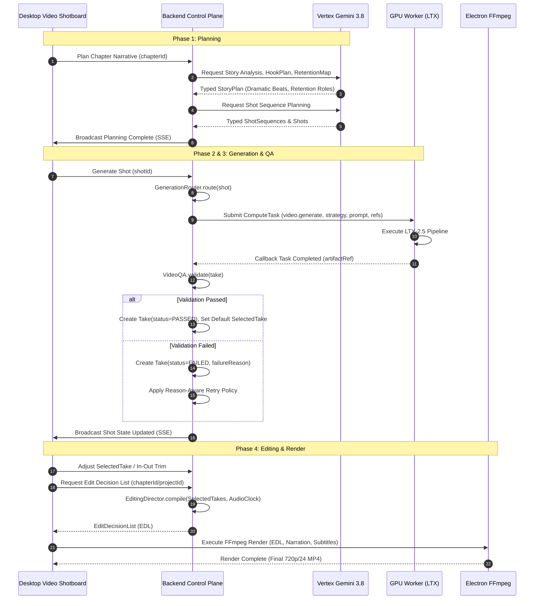

# Video-First Runtime Execution Flow

**Status:** Authoritative Runtime Specification  
**Authority:** ADR-0026, ADR-0027, ADR-0029, ADR-0030  
**Date:** 2026-09-20  

---

## 1. Sequence Overview

The runtime executes in four discrete phases:
1. **Narrative & Retention Planning** (Backend + Vertex Gemini)
2. **Shot Preparation & Generation Routing** (Backend + Auxiliary Reference Engine)
3. **GPU Video Compute & Quality Assurance** (GPU Worker + LTX-2.5 + QA Validator)
4. **Take Selection, Editing & Local Assembly** (Desktop Editor + Local FFmpeg)

---

## 2. Invariants

1. **Persist Intent Before I/O**: Every shot generation request writes a `Take` record in state `SUBMITTING` with an idempotency key before dispatching tasks to the GPU worker.
2. **No Direct Timeline Admission**: Generated video clips never appear in the edit decision list without passing `VideoQA` validation and explicit `SelectedTake` binding.
3. **Decoupled Durations**: The duration of moving footage produced by generative models (`sourceDurationMs`) is independent of the edit duration assigned on the narrative master clock (`timelineDurationMs = sourceOutMs - sourceInMs`).
4. **Idempotent Retries**: Retries must increment `attemptNumber` and record the specific failure reason. If the retry limit (default 2 retries, 3 total attempts) is reached, the shot transitions to `MANUAL_REVIEW`.
