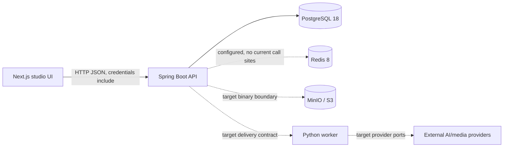

# NarrativeX Current Codebase Map

## Audit scope and status

- Baseline: V1.8 cut, 2026-08-18.
- Status: `PARTIAL`. This map records the current implementation boundary; historical W1-D1 command evidence remains under `documentation/audits/`.
- Current Git baseline: branch `main`, HEAD `f5fb996bcd942da60550902109fe4eb1fff305a3`.
- “Target” below is a later integration shape, not a claim that the target capability already exists.

## Repository layout

```text
app/backend-service/   Spring Boot modular monolith: API, feature slices, persistence adapters, Flyway, security
app/frontend-web/      Next.js App Router / React / TypeScript studio UI
app/ai-worker/         Python 3.12 worker foundation and provider ports
contracts/             versioned backend-to-worker JSON schema
docker-compose.yml     local PostgreSQL 18, Redis 8, MinIO and backend service
documentation/         architecture, domain, workflows, plans, ADRs and audit outputs
```

## Runtime architecture



Current reality: the backend owns the verified PostgreSQL path. The worker does not yet consume a durable queue or call the backend. The main frontend project list/create/story/analysis flow uses the API client; character, storyboard, render and asset capabilities remain explicit unsupported/prototype surfaces outside API mode.

## Backend modules (current)

| Module | Current responsibility | Runtime status |
|---|---|---|
| `project` | Project aggregate, story-version use cases, commands, ports and JPA adapters | real API/persistence; incomplete CRUD |
| `character` | Reusable Character identity, ProjectCharacter assignments, CharacterVersion lock lifecycle, appearance/outfit state and JPA adapters | domain/application/persistence slice; no HTTP API yet |
| `generation` | GenerationJob/OperationPlan aggregates, enqueue/read use cases, ports and JPA adapters | real persistence scaffold; no worker execution |
| `storyboard` | framework-free chapter/scene/visual-beat models plus JPA mappings | persistence mapping only; no controller/use-case API |
| `health` | provider configuration status response | diagnostic/configuration only, not a provider health probe |
| `feature.common` | `ApiResponse`/cursor-page success envelopes, `ErrorResponse` handlers, security writers and correlation IDs | API contract foundation for current JSON routes; future resource routes still pending |
| `feature.auth` | current-user/CSRF endpoints, SecurityContext identity, OIDC/local security chains and CORS | foundation implemented; shared environments require OIDC configuration |

## Frontend routes and visible features (current)

| Route | Visible surface | Current state |
|---|---|---|
| `/` | overview, project workspace, characters, wizard modals | project list/create/story/analysis path is API-backed; unsupported surfaces are explicit |
| `/auth` | login/register form and Google button | server-session bootstrap and OIDC redirect/logout foundation; password auth is not exposed |
| `/dashboard` | delegates to `/` shell | same as root; no route-param project loading |
| `/characters` | character library | explicit API-not-connected state in application mode; fixture UI only in test/Storybook |
| sidebar `assets` / `presets` | controls and prototype screens exist | fixture-backed prototype only; API contract pending |
| production views | chapters, workspace, storyboard, visual review, render, preview | backend project overview plus explicit unsupported-capability states; fixture screens only in test/Storybook |

## Worker architecture (current)

- Entrypoint: `python -m narrativex_worker` and `narrativex-worker` console script.
- `NarrativeXWorker` handles logging, dry-run and process cancellation; non-dry-run is an idle loop.
- `WorkerService` enforces rights attestation, builds a prompt with an explicit untrusted-story boundary, then calls a provider port.
- `DisabledProvider` fails closed; no real provider SDK, queue client, object-storage client, database client, lease, heartbeat, cancellation protocol or reconciliation loop is implemented.
- The worker is therefore `PORT_ONLY` plus a safe disabled adapter, not an integrated production worker.

## Database ownership and schema

- Backend owns the Flyway files and JPA mappings.
- PostgreSQL is intended to be authoritative; Redis has no current application call sites.
- V1 creates `schema_baseline`; V2 creates the initial domain tables; V3 adds control-plane tables/columns; V4 adds reusable character identity and assignments; V5 adds appearance invariants; V6 adds the Project keyset index.
- Historical empty-database startup evidence is retained in `documentation/audits/evidence/W1-D1_COMMAND_EVIDENCE.md`; it is not the current V1.8 schema inventory.
- Binary storage is only described in documentation/Compose; no backend or worker object-storage adapter is present.

## Redis usage

`spring-boot-starter-data-redis` and connection properties are present, but `rg` found no `RedisTemplate`, `StringRedisTemplate`, queue, stream, pub/sub, lock or progress implementation. Current classification is `UNUSED_CONFIGURED_DEPENDENCY`, not business state.

## Current vs target

| Capability | Current | Target needed for Week 2 |
|---|---|---|
| Project list/create | Backend real; visible UI uses API-backed Query data | cursor pagination edge cases and broader project fields |
| Story persistence | POST-only backend; visible wizard local | create/read/update story with version/If-Match semantics |
| Upload | UI placeholder/mock | upload intent, object-store upload, completion/validation |
| Async analysis | job/operation rows are inserted with zero estimate | reservation, idempotency, queue delivery, worker claim and recovery |
| Progress | fake interval/local store | persisted job read plus SSE/replayable event path |
| Auth/ownership | SecurityContext-backed identity; local/test fallback is profile-gated | broader workspace membership and production OIDC rollout |
| Media assets | UI mocks and remote sample images | private object storage, immutable asset metadata and access checks |

## Critical dependency graph

```text
FE visible action
  -> feature API client / TanStack Query
  -> existing /api/v1 project/story/job endpoints
  -> application outbound port
  -> infrastructure persistence adapter
  -> Spring Data JPA repository/JPA entity
  -> PostgreSQL via consolidated Flyway V1 baseline

Future async path:
  backend operation plan/reservation/job
  -> durable delivery hint / contract
  -> worker claim + lease + provider operation reservation
  -> provider adapter / media storage
  -> backend state transition + event/outbox
  -> FE polling/SSE
```

## Existing decisions validated

The audit found no architectural decision that should change in D1. The canonical constraints are now consolidated in ADR-0001 (modular monolith, worker, PostgreSQL authority and durable provider operations); the findings document incomplete implementation against them.
