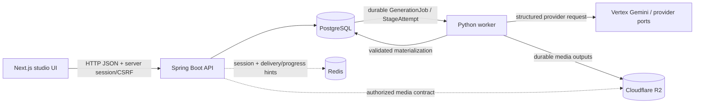

# NarrativeX Current Codebase Map

## Authority and scope

- Canonical product/architecture baseline: `documentation/source-of-truth/NARRATIVEX_PROJECT_SPEC_V1_10.md`.
- This file describes the current implementation on `main`; code, migrations and tests win when a derived document drifts.
- Historical V1.8/V1.9 audit evidence remains historical and must not be used as current implementation status.

## Repository layout

```text
app/backend-service/   Java 25 / Spring Boot 4 modular monolith, API and durable control plane
app/frontend-web/      Next.js 16 / React 19 / TypeScript studio UI
app/ai-worker/         Python 3.12 asynchronous AI execution worker
contracts/             versioned cross-runtime contracts
docker-compose.yml     local PostgreSQL, Redis, backend, frontend and worker topology; R2 is external managed media storage
documentation/         source of truth, architecture, domain, workflows, ADRs and codebase maps
```

## Runtime architecture



PostgreSQL is authoritative for durable application and execution state. Redis is non-authoritative for job correctness, although Redis-backed HTTP sessions are an availability dependency for authenticated sessions. The worker is an execution runtime, not a second product/domain authority. Cloudflare R2 is the sole durable binary-media object store; local worker disk is scratch/cache only.

## Backend features

| Area | Current implementation |
|---|---|
| Project | Project list/create/detail, StoryVersion foundation and Project Overview APIs are implemented. Project creation is metadata-only. |
| Chapter | Persisted Chapter CRUD/import foundation, workspace/read/update contracts and explicit Chapter Analyze entry point are implemented. |
| Generation | `OperationPlan -> GenerationJob -> StageAttempt -> ProviderOperation` durable execution model, admission checks and job reads are implemented foundations. |
| Storyboard | Chapter/Scene aggregate boundaries and VisualBeat foundation are implemented; Storyboard read/review foundations exist. Broader editing/version-reset workflows remain incomplete. |
| Character | Character library read/API foundation and ProjectCharacter/CharacterVersion persistence exist; full editing/version-lock/reference workflow remains incomplete. |
| Location | Read foundation exists, but AI Location materialization and durable Scene-location continuity are not complete. |
| Asset/media | Metadata/API foundations exist where documented, but image generation, TTS/subtitles, render/export and final artifact validation are not implemented end-to-end. |
| Auth | Spring Security server session + CSRF, password auth, Google OIDC and Redis-backed Spring Session are the browser contract. JWT is not the current browser contract. |
| Quota/notifications | Backend read foundations exist; complete billing reconciliation and broader delivery lifecycle remain follow-up work. |

## Storyboard aggregate map

```text
StoryVersion (project feature)
       |
       | storyVersionId
       v
Chapter (AggregateRoot)
       |
       | chapterId
       v
Scene (AggregateRoot)
       |
       v
VisualBeat (DomainEntity)
```

`Chapter` owns chapter-level source/title/order behavior. `Scene` is independent because scene edits and generation are scene-granular. `VisualBeat` is owned by Scene. Cross-feature orchestration and provider/storage calls stay outside domain aggregates. See ADR-0007.

## Durable Chapter Analyze

```text
persisted Chapter
  -> safety / entitlement / quota / cost admission
  -> OperationPlan + GenerationJob + StageAttempt + OutboxEvent
  -> commit
  -> optional Redis delivery hint
  -> worker PostgreSQL claim/lease/heartbeat
  -> ProviderOperation RESERVED before external submission
  -> provider execution / reconciliation
  -> validated Character + Scene + VisualBeat materialization
  -> terminal durable job state
```

The client does not provide arbitrary unsaved story text as analysis authority. The backend reloads persisted Chapter state, and the worker validates the Chapter snapshot (`rowVersion`/`sourceHash`) before materializing results.

## Worker architecture

The Python 3.12 worker is a real asynchronous execution runtime, not the earlier idle-loop scaffold.

- Claims durable work from PostgreSQL with `FOR UPDATE ... SKIP LOCKED`.
- Uses StageAttempt lease ownership and heartbeats; stale work can be reclaimed.
- Uses bounded `WORKER_CONCURRENCY` (default 4, bounded by worker configuration).
- Uses Pydantic for request/result validation, asyncpg for PostgreSQL, HTTPX for HTTP and google-auth for Vertex credentials.
- Safe default provider mode is `disabled`; the configured real adapter is Vertex Gemini.
- Validates the Chapter snapshot before result materialization.
- Persists current Chapter-analysis Character/ProjectCharacter/CharacterVersion and Scene/VisualBeat results.
- Location materialization and Scene character/location continuity relations remain incomplete.
- Image generation, TTS/subtitles and render/export remain future execution stages under the R2-only durable media contract.

There is no FastAPI service in the current worker dependency/runtime contract. Browser/client APIs remain owned by Spring Boot.

## Frontend integration state

The frontend uses Next.js App Router, TanStack Query for server state and Zustand only for transient editor/wizard state.

Current connected foundations include project list/detail/create, Project Overview, StoryVersion/Chapter flows, Chapter Analyze/job polling, Storyboard foundations and Character/Location/Asset client foundations as recorded in `FRONTEND_API_INTEGRATION_MATRIX.md`.

Backend availability must not be confused with frontend wiring: Job History, Quota and Notifications have backend foundations but still require complete production UI integration. Presets and render/export remain pending capabilities.

API mode must never silently substitute fixtures for unavailable production data.

## Database and infrastructure ownership

- Backend owns Flyway and JPA schema mappings.
- `V1__initial_schema.sql` is the consolidated development schema baseline.
- `V2__seed_demo_data.sql` contains deterministic local/demo data.
- PostgreSQL owns durable domain/job/quota/safety state.
- Redis owns Spring Session state and may carry non-authoritative delivery/progress hints.
- Cloudflare R2 owns durable binary media across environments; PostgreSQL owns metadata/keys/checksums/lineage. Worker-local media paths are transient only.

## Current vs remaining work

| Capability | Current V1.10 state | Remaining work |
|---|---|---|
| Project Overview | IMPLEMENTED | richer product metrics only as contracts require |
| Chapter CRUD/import | IMPLEMENTED foundation | delete/reorder and broader UX where not yet wired |
| Chapter Analyze | IMPLEMENTED durable pipeline | production hardening and complete actual-cost reconciliation |
| Worker claim/lease | IMPLEMENTED | broader recovery/observability evidence |
| Provider lifecycle | IMPLEMENTED foundation | complete reconciliation/usage hardening for all future provider operations |
| Storyboard/VisualBeat | IMPLEMENTED foundation | broader editing, approved reset/versioning and continuity |
| Character library | IMPLEMENTED read/API foundation | editing/version locking/reference assets |
| Location | PARTIAL | AI materialization + Scene continuity relation |
| Assets | PARTIAL foundation | upload/finalize/review plus generated media lifecycle |
| Image/TTS/render/export | PENDING | R2-backed implementation and FinalArtifact validation |
| Billing | PARTIAL | actual-usage reconciliation and unused reservation release |

## Critical dependency direction

```text
Frontend action
  -> owning Spring feature API
  -> application command/query/use case
  -> domain aggregate behavior
  -> outbound port / persistence adapter
  -> PostgreSQL or external infrastructure

Durable AI work
  -> backend admission + durable execution rows
  -> worker claim/lease
  -> provider port
  -> validated materialization
  -> durable terminal state
```

Domain aggregates do not call Redis, provider SDKs, object storage or worker runtimes directly.

## Maintained decisions

- ADR-0001: modular monolith, worker boundary, PostgreSQL authority and durable execution.
- ADR-0002: chapter-first workflow/navigation and affected-scope processing.
- ADR-0003: DDD feature/package/API contracts.
- ADR-0007: Chapter/Scene independent storyboard aggregate boundaries.
- ADR-0008: Redis-backed HTTP sessions.
