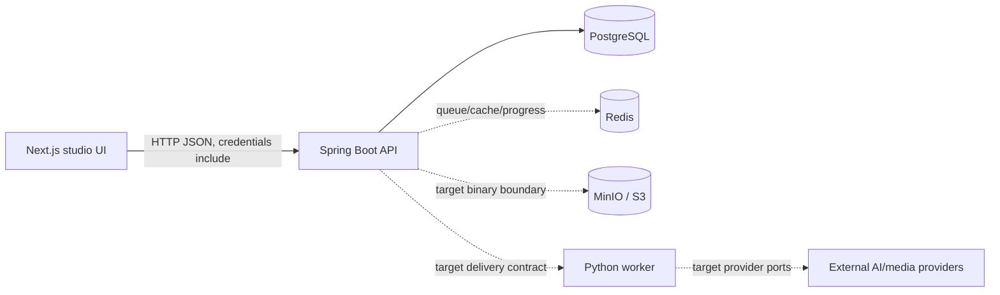

# NarrativeX Current Codebase Map

## Audit scope and status

- Baseline: V1.8 cut, 2026-08-18.
- Status: `PARTIAL`. This map records the current implementation boundary; historical audit evidence remains under `documentation/audits/`.
- Active refactor branch for the current storyboard decision: `agent/storyboard-aggregate-boundaries`.
- “Target” below is a later integration shape, not a claim that the capability already exists.

## Repository layout

```text
app/backend-service/   Spring Boot modular monolith: API, feature slices, persistence adapters, Flyway, security
app/frontend-web/      Next.js App Router / React / TypeScript studio UI
app/ai-worker/         Python 3.12 worker foundation and provider ports
contracts/             versioned backend-to-worker JSON schema
docker-compose.yml     local PostgreSQL, Redis, MinIO and backend service
documentation/         architecture, domain, workflows, plans, ADRs and audit outputs
```

## Runtime architecture



PostgreSQL is canonical application state. Redis is acceleration/delivery infrastructure. MinIO/S3 holds binary media once the storage adapter is implemented.

## Backend features (current)

| Feature | Current responsibility | Runtime status |
|---|---|---|
| `project` | Project aggregate, StoryVersion creation/versioning, commands, ports and JPA adapters | real API/persistence foundation; incomplete CRUD |
| `character` | reusable Character identity, ProjectCharacter assignments, CharacterVersion lifecycle, appearance/outfit state and JPA adapters | domain/application/persistence slice; public REST incomplete |
| `generation` | GenerationJob/OperationPlan aggregates, enqueue/read use cases, ports and JPA adapters | real persistence scaffold; worker execution incomplete |
| `storyboard` | `Chapter` and `Scene` aggregate roots, `VisualBeat` child entity, Scene lifecycle, JPA mappings | domain/persistence foundation; repositories/use cases/public API pending |
| `health` | provider/configuration status response | diagnostic/configuration only |
| `common` | DDD primitives, API response/error/correlation helpers and generic pagination | shared kernel; no business policy |
| `auth` | current-user/CSRF endpoints, SecurityContext identity, OIDC/local security chains and CORS | foundation implemented |

### Storyboard aggregate map

```text
StoryVersion (project feature)
       |
       | storyVersionId
       v
Chapter (AggregateRoot)
       |
       | chapterId
       v
Scene (AggregateRoot)
       |
       v
VisualBeat (DomainEntity)
```

`Chapter` owns chapter title/order behavior. `Scene` is independent because scene edits and AI generation are scene-granular and may execute concurrently. `Scene` owns its canonical lifecycle. Cross-feature/provider/storage orchestration remains outside the aggregates. See ADR-0007.

## Scene lifecycle implemented in domain

```text
DRAFT
  -> READY_FOR_VISUAL
  -> GENERATING
  -> REVIEW
  -> APPROVED

GENERATING -> FAILED
APPROVED + edit -> OUTDATED
```

- Invalid predecessor transitions throw `InvalidSceneTransitionException`.
- Edits are rejected while `GENERATING` or `REVIEW`.
- Editing an approved scene marks mutable scene state `OUTDATED`; historical outputs are not overwritten.
- `SceneStatus` is persisted as an enum string.

## Frontend routes and visible features (current)

| Route/surface | Current state |
|---|---|
| project list/create/story/analysis flow | API-backed foundation |
| `/characters` | API surface still incomplete; fixture/test UI may exist |
| storyboard/chapters/visual review | visible/prototype surfaces; backend write/read API still pending |
| assets/presets/render | partial/prototype or unsupported until backend contracts exist |

Frontend feature/page boundaries do not define backend aggregate or feature boundaries.

## Worker architecture (current)

- Python 3.12 worker has typed/provider-neutral execution boundaries.
- Worker is execution infrastructure, not canonical domain authority.
- It must not mutate arbitrary Scene state directly; results are applied through backend contracts/use cases.
- Durable intake/lease/storage/media/provider integration remains incomplete.

## Database ownership and schema

- Backend owns Flyway and JPA mappings.
- `V1__initial_schema.sql` is the complete consolidated schema baseline.
- `V2__seed_demo_data.sql` contains deterministic local/demo rows for the V1 schema.
- `chapters` and `scenes` remain separate relational tables with unique order constraints.
- Independent tables/FKs do not by themselves define DDD aggregate ownership.
- Binary storage remains outside PostgreSQL.

## Redis and object storage

Redis is not source of truth. Queue/progress delivery must be reconstructable from durable database/job state. MinIO/S3 is the target binary store; PostgreSQL owns Asset metadata/storage keys/checksums once the Asset feature is implemented.

## Current vs target

| Capability | Current | Target |
|---|---|---|
| Project list/create | backend/API real | broader project fields and remaining CRUD |
| Story persistence | create foundation | read/update/version/If-Match semantics |
| Storyboard domain | Chapter + Scene aggregates and lifecycle implemented | aggregate repositories, commands/queries/controllers, read projections |
| Upload/assets | UI/storage infrastructure foundation only | upload intent, signed/direct upload, validation and Asset metadata |
| Async analysis | persisted generation foundation | reservation, idempotency, delivery, worker claim and recovery |
| Progress | partial | durable job state + SSE/replay path |
| Scene generation | domain lifecycle exists | `Scene -> GenerationJob -> Asset` orchestration through application ports |
| Auth/ownership | SecurityContext/OIDC foundation | broader workspace membership and full production rollout |

## Critical dependency graph

```text
FE action
  -> owning feature API
  -> application command/query/use case
  -> aggregate business method
  -> application outbound port
  -> infrastructure adapter
  -> PostgreSQL / external system
```

For Scene generation specifically:

```text
GenerateScene use case
  -> load Scene aggregate
  -> Scene.startGeneration()
  -> save Scene
  -> create/enqueue GenerationJob
  -> worker/provider
  -> Asset/output validation
  -> application command updates Scene lifecycle
```

The Scene aggregate never calls Redis, provider SDKs or MinIO/S3 directly.

## Existing decisions validated

- ADR-0001: modular monolith, worker boundary, PostgreSQL authority and durable execution.
- ADR-0002: chapter-first workflow/navigation and incremental affected scope.
- ADR-0003: DDD feature/package/API contracts.
- ADR-0007: Chapter/Scene independent storyboard aggregate boundaries.
