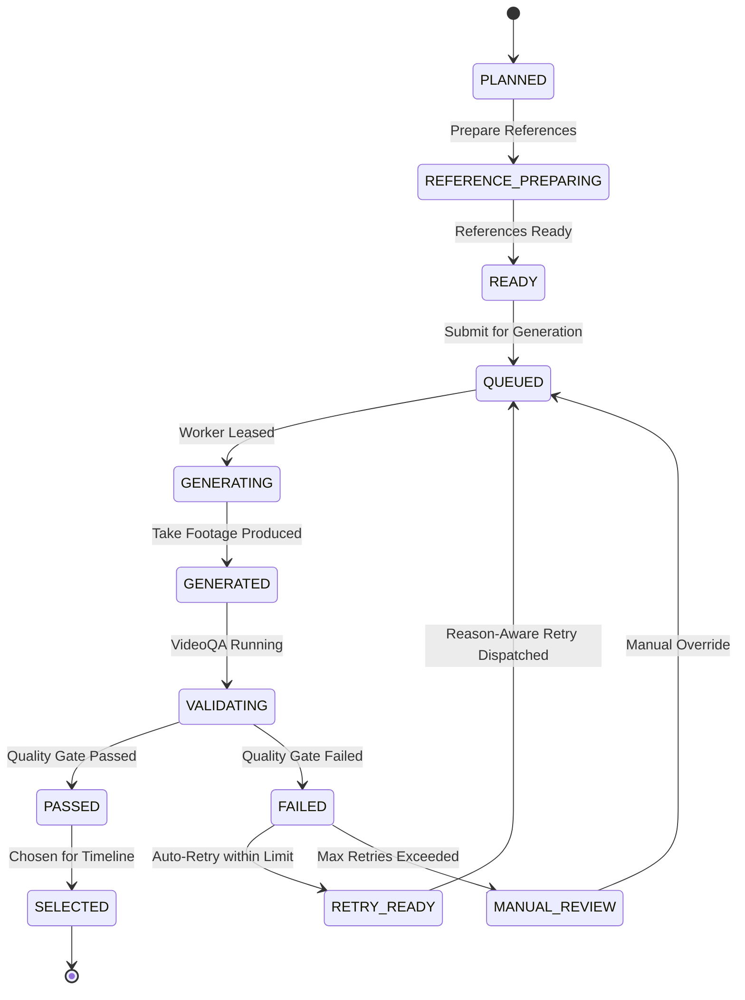

# Shot Domain Model

**Status:** Authoritative Domain Specification  
**Authority:** ADR-0027, ADR-0029, ADR-0030  
**Date:** 2026-09-20  

---

## 1. Shot as the Atomic Production Unit

A `Shot` is the definitive production unit in NarrativeX. It represents a continuous take generated by a video model, governed by camera movement, subject action, and temporal progression.

---

## 2. Entities & Schema

### ShotSequence
```typescript
interface ShotSequence {
  id: string;
  visualBeatId: string;
  orderIndex: number;
  shots: Shot[];
}
```

### Shot Aggregate
```typescript
interface Shot {
  id: string;
  sequenceId: string;
  orderIndex: number;

  narrativePurpose: string;      // Why this shot exists in the story
  retentionRole?: RetentionRole;

  subjects: SubjectRef[];
  locationRef?: string;

  startState: ShotState;        // Initial actor pose, composition, environment
  action: ShotAction;           // Specific kinetic activity occurring during the shot
  endState: ShotState;          // Resulting pose or composition at cut point

  composition: Composition;      // Shot size, framing, angle
  camera: CameraPlan;            // Lens, focal length, height
  
  subjectMotion: MotionPlan;     // Speed, direction of actor movements
  cameraMotion: MotionPlan;      // Pan, tilt, track, dolly, crane, static
  environmentMotion: MotionPlan; // Wind, rain, background extras, atmospheric particles

  targetDurationMs: number;      // Anticipated duration on timeline
  generationStrategy: GenerationStrategy;
  qualityProfile: QualityProfile;

  continuityFromShotId?: string; // Preceding shot ID for temporal continuity
  continuityToShotId?: string;   // Succeeding shot ID

  status: ShotStatus;
  selectedTakeId?: string;
}
```

---

## 3. Shot State Machine



### State Definitions
- `PLANNED`: Initial definition generated by Shot Director.
- `REFERENCE_PREPARING`: Collecting/generating character and location reference assets.
- `READY`: All inputs, prompts, and references validated; ready for GPU admission.
- `QUEUED`: Enqueued in backend control plane awaiting worker capability lease.
- `GENERATING`: Dispatched to GPU worker and actively executing on LTX-2.5.
- `GENERATED`: Footage received from worker; stored as candidate `Take`.
- `VALIDATING`: Passing through automated `VideoQA` checks.
- `PASSED`: Met all quality criteria; eligible for timeline inclusion.
- `FAILED`: Violated one or more QA criteria (with failure reason recorded).
- `RETRY_READY`: Ready for re-submission with adjusted prompt/parameters based on failure reason.
- `MANUAL_REVIEW`: Requires user review in Desktop editor (prompt edit, take pick, or strategy change).
- `SELECTED`: Active take bound to the `EditDecisionList`.
