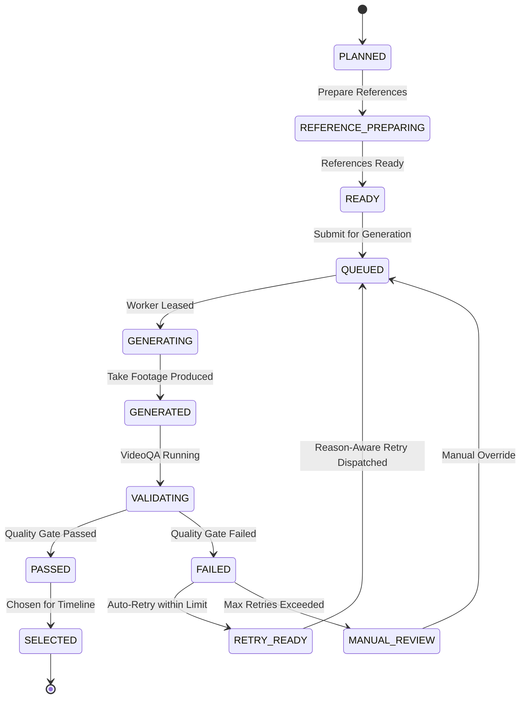

# Shot Domain Model

**Status:** Authoritative Domain Specification  
**Authority:** ADR-0027, ADR-0029, ADR-0030  
**Date:** 2026-09-20  

---

## 1. Shot as the Atomic Production Unit

A `Shot` is the definitive production unit in NarrativeX. It represents a continuous take generated by a video model, governed by camera movement, subject action, and temporal progression.

---

## 2. Entities & Schema

### ShotSequence
```typescript
interface ShotSequence {
  id: string;
  visualBeatId: string;
  orderIndex: number;
  shots: Shot[];
}
```

### Shot Aggregate
```typescript
interface Shot {
  id: string;
  sequenceId: string;
  orderIndex: number;

  narrativePurpose: string;      // Why this shot exists in the story
  retentionRole?: RetentionRole;

  subjects: SubjectRef[];
  locationRef?: string;

  startState: ShotState;        // Initial actor pose, composition, environment
  action: ShotAction;           // Specific kinetic activity occurring during the shot
  endState: ShotState;          // Resulting pose or composition at cut point

  composition: Composition;      // Shot size, framing, angle
  camera: CameraPlan;            // Lens, focal length, height
  
  subjectMotion: MotionPlan;     // Speed, direction of actor movements
  cameraMotion: MotionPlan;      // Pan, tilt, track, dolly, crane, static
  environmentMotion: MotionPlan; // Wind, rain, background extras, atmospheric particles

  targetDurationMs: number;      // Anticipated duration on timeline
  generationStrategy: GenerationStrategy;
  qualityProfile: QualityProfile;

  continuityFromShotId?: string; // Preceding shot ID for temporal continuity
  continuityToShotId?: string;   // Succeeding shot ID

  status: ShotStatus;
  selectedTakeId?: string;
}
```

---

## Durable Shot Admission (IMPLEMENTED)

`POST /api/v1/projects/{projectId}/shots/{shotId}/takes` requires `Idempotency-Key`.
The admission transaction locks the key and current Shot/Chapter, checks queue capacity,
and persists one PENDING Take, GenerationJob, scoped OperationPlan, StageAttempt and
outbox event. It performs no external submission. The response always supplies the
Take ID and public generation job ID (`generationJobId`, with `jobId` retained).
An identical replay returns that Take; changed inputs under the same key return 409.
A new regeneration key creates a new attempt, while UNKNOWN attempts require reconciliation.

Take persistence stores typed job/task/attempt/plan links and immutable
`inputSnapshotJson`/`inputFingerprint`. The snapshot freezes script/source revision,
shot inputs, real AudioCue text/delivery/status, participating locked CharacterVersions,
voice description/profile version, optional reference integrity metadata, provider/model,
configured workflow revision, strategy, seed, deadline and audio mode. Reference frames
must be READY in the same Project and attached to an approved VisualBeat. I2V needs a
start frame; First/Last Frame needs both. A voice description can be used without
reference audio. `sourceDurationMs` stays null until produced media is probed.

Queue admission uses the shared system capacity limit; waiting jobs do not occupy the
single video execution slot. Submission claims serialize that slot across SUBMITTING,
SUBMITTED, RUNNING, UNKNOWN and reconciliation/stalled states. An occupied slot leaves
the outbox event pending. Dispatch consumes only frozen Take inputs and creates expiring
artifact capabilities after commit; later Shot, voice or model edits cannot rewrite an
admitted attempt. Legacy non-shot dispatch remains supported.

Audio mode is pinned as `LTX_NATIVE_AV` (default) or explicit `AUDIO_FIRST`.
**PARTIAL:** the current `video.generate` wire schema remains 1.0. Native-audio controls
and capability validation are the subsequent schema 1.1 implementation, not a claim
of verified joint AV production or GPU health.

---

## 3. Shot State Machine


```mermaid
stateDiagram-v2
    [*] --> PLANNED
    PLANNED --> REFERENCE_PREPARING : Prepare References
    REFERENCE_PREPARING --> READY : References Ready
    READY --> QUEUED : Submit for Generation
    QUEUED --> GENERATING : Worker Leased
    GENERATING --> GENERATED : Take Footage Produced
    GENERATED --> VALIDATING : VideoQA Running
    
    VALIDATING --> PASSED : Quality Gate Passed
    VALIDATING --> FAILED : Quality Gate Failed
    
    FAILED --> RETRY_READY : Auto-Retry within Limit
    FAILED --> MANUAL_REVIEW : Max Retries Exceeded
    
    RETRY_READY --> QUEUED : Reason-Aware Retry Dispatched
    MANUAL_REVIEW --> QUEUED : Manual Override
    
    PASSED --> SELECTED : Chosen for Timeline
    SELECTED --> [*]
```

### State Definitions
- `PLANNED`: Initial definition generated by Shot Director.
- `REFERENCE_PREPARING`: Collecting/generating character and location reference assets.
- `READY`: All inputs, prompts, and references validated; ready for GPU admission.
- `QUEUED`: Enqueued in backend control plane awaiting worker capability lease.
- `GENERATING`: Dispatched to GPU worker and actively executing on LTX-2.5.
- `GENERATED`: Footage received from worker; stored as candidate `Take`.
- `VALIDATING`: Passing through automated `VideoQA` checks.
- `PASSED`: Met all quality criteria; eligible for timeline inclusion.
- `FAILED`: Violated one or more QA criteria (with failure reason recorded).
- `RETRY_READY`: Ready for re-submission with adjusted prompt/parameters based on failure reason.
- `MANUAL_REVIEW`: Requires user review in Desktop editor (prompt edit, take pick, or strategy change).
- `SELECTED`: Active take bound to the `EditDecisionList`.
