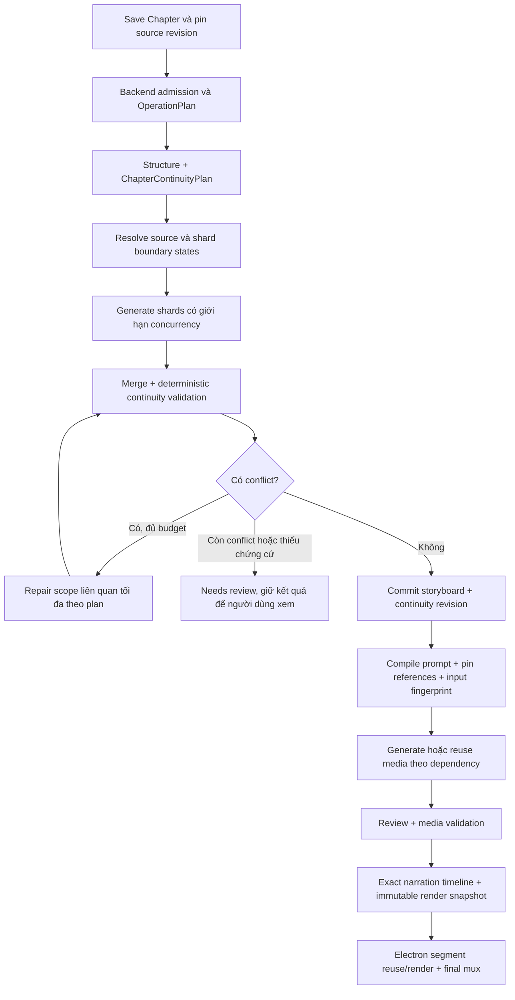

# Chapter Continuity & Render Pipeline — Implementation Plan

> **For agentic workers:** Dùng `superpowers:executing-plans` để triển khai lần lượt các task và checkpoint trong tài liệu. Các bước dùng checkbox để theo dõi. Chỉ dùng subagent khi người dùng yêu cầu hoặc hướng dẫn áp dụng cho lượt triển khai cho phép.

**Goal:** Giữ prompt và ảnh nhất quán theo diễn biến chapter, giảm gọi AI lặp lại khi lỗi/chỉnh sửa, và tái sử dụng đúng các render segment không bị ảnh hưởng.

**Architecture:** Giữ Spring Boot modular monolith, Python AI worker và Electron main. Bổ sung kế hoạch continuity có phiên bản trước bước sinh beat song song; kiểm tra kết quả toàn chapter trước khi chốt prompt; lưu checkpoint từng lần gọi provider vào PostgreSQL và liên kết generation/render với snapshot bất biến.

**Tech Stack:** Java/Spring Boot, MyBatis, PostgreSQL/Flyway, Python/Pydantic/asyncio, TypeScript/Electron, React Query, FFmpeg/ffprobe.

**Spec:** Thiết kế TARGET nằm tại mục 3–8 của chính tài liệu này, cụ thể hóa hướng cải thiện đã trao đổi ngày 2026-09-05. Đối chiếu [STORY_TO_VIDEO](../workflows/STORY_TO_VIDEO.md), [IMAGE_GENERATION](../workflows/IMAGE_GENERATION.md), [ADR-0020](../decisions/ADR-0020-postgresql-only-mvp-runtime-state.md), [ADR-0023](../decisions/ADR-0023-source-anchored-visual-timing.md) và code hiện tại.

**Trạng thái:** PROPOSED / TARGET. Đây là kế hoạch, chưa phải bằng chứng tính năng đã triển khai hoặc provider đã được kiểm chứng. Chưa chạy chapter/ảnh thực tế để đo mức cải thiện.

## 1. Global constraints

- PostgreSQL là nguồn durable state, queue, lease, reservation, checkpoint và lineage; không thêm Redis, broker hoặc microservice.
- Backend giữ quyền admission, ownership, entitlement, quota, idempotency và chi phí. Mọi bước AI phát sinh chi phí, kể cả repair/review, phải nằm trong OperationPlan và reservation.
- Persist provider reservation/outbox state trước external submission. Kết quả mơ hồ là `UNKNOWN`; reconcile trước retry, không blind-resubmit.
- Character là identity dùng lại thuộc User/Workspace; ProjectCharacter là participation. Không tạo Character mới cho thay đổi outfit, tuổi, tóc hoặc thương tích.
- Locked CharacterVersion, approved assets, provider snapshots và render snapshots bất biến. Thay đổi tạo revision mới.
- Context gửi cho scene/beat chỉ chứa các nhân vật tham gia scope đó. Tóm tắt toàn chapter không được trở thành cách đưa toàn bộ character bible vào mọi beat.
- Story, summary, continuity fact, model output và reference đều là dữ liệu không tin cậy. Không nâng summary hay output AI thành system instruction.
- Không thêm blanket rights checkbox. Reference người thật giữ consent, isolation, retention/deletion tại boundary hiện có.
- Số beat dựa trên duration, semantic complexity và reuse/delta. Không gán cứng số ảnh cho chapter hoặc một câu một ảnh.
- Narration/alignment là master clock. Giữ `source_anchor -> UTF-16 text range -> narration alignment`; timing tạm không cho phép render.
- Renderer chỉ gọi API/bridge thật. Electron main giữ session transport, filesystem, Gemini Web/CDP và FFmpeg. Không đưa provider secret/token Google vào renderer.
- Project media/final MP4 local-first; backend dùng ID, checksum, artifact key tương đối, không lưu absolute Desktop path hay chuyển project media qua R2.
- Mọi thay đổi UI phải dùng semantic design tokens và qua runtime verification theo AGENTS.md; build/test không thay thế bước này.
- Giữ nguyên thay đổi có sẵn trong worktree. Kế hoạch này không cho phép reset database, xóa local media hay commit/push thay người dùng.

## 2. AS-IS và bằng chứng

Các đường dẫn trong tài liệu tính từ repo root, trừ link Markdown có đường dẫn tương đối riêng.

| Thành phần | Triển khai đã đọc | Khoảng trống liên quan |
| --- | --- | --- |
| Desktop analysis admission | `app/desktop/src/renderer/features/generation/api/generation.api.ts` | POST analysis-jobs tạo Idempotency-Key mới mỗi lần gọi; cần giữ key cho retry của cùng một thao tác |
| Gọi phân tích | `app/ai-worker/src/narrativex_worker/providers/vertex.py` | Structure trước, shard tasks chạy song song qua semaphore, merge sau; dữ liệu từng shard đang được gom trong memory của lần submit |
| Structure schema | `app/ai-worker/src/narrativex_worker/chapter_analysis_sharding.py` | Có characters, locations, scene anchors/signals; chưa có hợp đồng entry/exit state riêng |
| Shard prompt | `app/ai-worker/src/narrativex_worker/chapter_analysis_prompts.py` | Context gồm scene title, cast, location, signals và shard source; thiếu continuity boundary và diễn biến trước/sau |
| Merge/shot planner | `chapter_analysis_sharding.py`, `visual_prompt/sequence_planner.py` dưới worker | Kiểm tra anchor/count/cast, phối hợp shot/lens; chưa kiểm tra chuyển trạng thái đạo cụ, ngoại hình, thời gian |
| Final prompt | `app/backend-service/src/main/java/com/narrativex/backend/feature/generation/application/service/VisualPromptComposer.java` | Đã có identity, appearance, location, visual direction, reference map; chưa có chapter/scene continuity contract |
| Context persistence | `generation/infrastructure/persistence/adapter/MyBatisVisualPromptContextPersistenceAdapter.java` dưới backend feature root | Resolve location, characters và references theo beat; cần thêm state được chốt tại thời điểm beat |
| Provider durability | `app/ai-worker/src/narrativex_worker/repository/__init__.py`, `repository/implementation.py` | Có facade ownership fencing và provider-operation state; phải mở rộng ở granularity subcall, không tạo queue song song hoặc bypass facade |
| Production render | `generation/application/usecase/CreateProjectRenderUseCase.java`, `app/desktop/src/main/rendering/project-renderer.ts` | Đã có admission/snapshot/local execution; tập trung dependency, stale input và cache correctness |

**Giả thuyết cần kiểm chứng:** các shard độc lập có thể diễn giải khác nhau về trạng thái cùng một sự kiện; prompt compiler sau đó không có dữ liệu để phát hiện/sửa sự lệch đó. Đây là nhận định từ cấu trúc code, không phải kết luận rằng mọi ảnh lỗi đều do sharding. Reference thiếu, provider variation và dữ liệu canon sai vẫn có thể gây drift.

## 3. Phạm vi và lựa chọn thiết kế

### 3.1 Phương án được chọn

Mở rộng structure pass thành **ChapterContinuityPlan**, phân giải state ở scene/shard boundary trước khi sinh beat, giữ generation song song cho các shard đã có đủ boundary state. Sau merge chạy validator và repair giới hạn; backend chốt snapshot để cả API image và Gemini Web dùng cùng đầu vào.

| Phương án | Ưu điểm | Đánh đổi | Quyết định |
| --- | --- | --- | --- |
| Gửi toàn chapter cho từng shard | Dễ thử nghiệm | Lặp token, tăng latency, không bảo đảm state nhất quán | Không dùng làm mặc định |
| Sinh tuần tự toàn bộ beat, truyền kết quả trước sang sau | Dễ duy trì trạng thái cục bộ | Chậm, lỗi tích lũy, retry phụ thuộc chuỗi dài | Chỉ tuần tự hóa nhánh thực sự phụ thuộc |
| Chốt continuity trước, sinh shard song song, validate sau | Giữ throughput, có nguồn state chung và kiểm chứng | Cần schema/checkpoint/versioning | Chọn |

### 3.2 Các mốc giao hàng

- **M1 — Chất lượng prompt:** Task 1–7. Có continuity có căn cứ, checkpoint an toàn, validator và compiler dùng state theo beat.
- **M2 — Creator flow:** Task 8–9. Có selective regeneration, giải thích warning/stale và review trong Desktop.
- **M3 — Render và rollout:** Task 10–11. Cache/snapshot đúng, đo chất lượng/chi phí, phát hành có kiểm soát.

Không làm trong vòng này: continuity tự động toàn bộ tiểu thuyết, character recognition model riêng, hệ thống microservice orchestration, đổi model để chữa drift, video-provider mới, hoặc nối mọi ảnh thành một chuỗi image-to-image bắt buộc.

## 4. Luồng TARGET



`Needs review` là trạng thái của continuity report/scope, không thêm moderation state cho StoryVersion. Job hoàn tất phân tích có thể kèm report cần review; không được tự bật generation cho scope có hard conflict.

### 4.1 Thứ tự API/provider call

1. Desktop lưu source; backend nhận chapter ID và pin source hash/row version từ DB.
2. Desktop tạo một analysis job; backend giữ API hiện có, enqueue qua durable state hiện có.
3. Structure call nhận toàn chapter và canon đã được phép resolve; trả về scene boundaries, event ledger và state declarations.
4. Code resolve source anchors và chia shard. Nếu event ledger thiếu boundary fact cần thiết, dùng một boundary-enrichment call có reservation; không để mọi shard tự đoán.
5. Các shard đủ entry/exit state chạy song song qua shared concurrency gate. Shard chưa đủ state dừng ở bước review/enrichment, không fallback âm thầm sang prompt cũ.
6. Merge, deterministic checks, optional semantic audit và bounded repair. Mỗi external call có durable identity riêng.
7. Commit source-current storyboard, plan, beat states và report trong một transaction.
8. Image generation pin prompt/ref snapshot trước submit. Reference có dependency phải READY/approved trước khi các beat phụ thuộc được chạy.
9. SSE hiện có truyền progress; GET watchdog chỉ chạy khi job active. Reconnect không tạo job mới.

### 4.2 Chính sách chi phí ban đầu

- Số lần gọi bình thường là `1 structure + S shard`; mở rộng structure output trước khi thêm lượt AI mới.
- Boundary enrichment/semantic audit chỉ khi có lý do cụ thể và budget đã reserve; tối đa một lượt cho mỗi scope trong cấu hình ban đầu.
- Repair semantic tối đa một lượt thay thế mỗi shard bị flag trong cấu hình ban đầu. Schema repair hiện có cũng phải tính vào tổng call budget.
- Hết budget: trả report hoặc `PAUSED_COST_LIMIT` theo contract hiện có; không tự nâng chi phí, đổi model hay lặp tới khi model đồng ý.
- `maxAuthorizedCost` là trần do người dùng cho phép; estimate do backend tính. Reconciliation dùng tổng usage thực của tất cả subcalls kể cả khi một shard thất bại.
- Không hứa trước phần trăm giảm token/latency. Đo trên cùng corpus và cùng provider/config trước khi đặt mức cải thiện trong release note.

## 5. Data contract và persistence

### 5.1 Contract đề xuất

Schema mới dùng `schemaVersion = 1`; giữ model/provider output tách khỏi DB IDs do hệ thống cấp. Model phát stable keys; materialization resolve keys sang IDs trong tenant hiện tại.

| Type | Field cốt lõi | Quy tắc |
| --- | --- | --- |
| `ChapterContinuityPlan` | `schemaVersion`, `sourceHash`, `summary`, `events`, `sceneStates`, `visualStyleConstraints` | Source/revision do backend/worker wrapper gắn, không tin giá trị model tự khai |
| `ContinuityEvent` | `key`, `sourceAnchor`, `timelineKey`, `changes` | Anchor phải tìm được đúng thứ tự trong source; flashback dùng timeline riêng |
| `ContinuityFact` | `subjectKey`, `predicate`, `value`, `provenance`, `evidenceAnchor`, `canonVersionId` | `provenance`: SOURCE, APPROVED_CANON hoặc UNKNOWN; UNKNOWN dùng value null |
| `SceneContinuityState` | `sceneKey`, `timelineKey`, `entryFacts`, `exitFacts`, `eventKeys` | Không tự truyền state hiện tại sang flashback hoặc timeline khác |
| `ShardContinuityContext` | `planId`, `sceneKey`, `entryFacts`, `expectedExitFacts`, `neighborSource`, `allowedCharacterKeys` | Lọc cast; neighborSource chỉ để đọc, không là phạm vi sinh beat |
| `BeatContinuityState` | `beatKey`, `entryFacts`, `visibleFacts`, `exitFacts`, `eventKeys` | Prompt ảnh dùng visibleFacts tại đúng khoảnh khắc, không lấy exit state của cả chapter |
| `ContinuityIssue` | `code`, `severity`, `scopeKeys`, `evidenceAnchors`, `message`, `origin` | severity BLOCKING/WARNING; origin DETERMINISTIC/SEMANTIC/HUMAN |
| `ContinuityReport` | `planId`, `revision`, `status`, `issues` | status PASS/NEEDS_REVIEW; model judgment không tự biến thành sự thật |
| `PromptInputSnapshot` | `planId`, `beatStateId`, `canonIds`, `referenceBindings`, `finalPrompt`, `negativePrompt`, `compilerVersion`, `inputFingerprint` | Snapshot bất biến; tất cả generation paths dùng chính snapshot này |

Predicate ban đầu giới hạn ở `appearance`, `location`, `time_of_day`, `prop_owner`, `prop_position`, `screen_direction`, `lighting`. Dùng schema riêng cho giá trị mỗi predicate, không chấp nhận dict tùy ý. `appearance` trỏ CharacterAppearance/OutfitVersion hiện có; không dựng identity thứ hai.

Ví dụ chuyển trạng thái, là fixture thiết kế, không phải dữ liệu runtime:

```json
{
  "key": "put_sword_on_table",
  "sourceAnchor": "Lan đặt thanh kiếm lên bàn.",
  "timelineKey": "present",
  "changes": [{
    "subjectKey": "sword",
    "predicate": "prop_position",
    "value": "table",
    "provenance": "SOURCE",
    "evidenceAnchor": "Lan đặt thanh kiếm lên bàn.",
    "canonVersionId": null
  }]
}
```

Không yêu cầu model bịa giá trị khi source im lặng. Conservative visual defaults chỉ được thiết lập một lần trong canon phù hợp, đánh dấu là design choice được review; không gắn nhãn SOURCE cho chi tiết suy diễn.

### 5.2 Bảng/quan hệ TARGET

| Persistence | Nội dung và constraint |
| --- | --- |
| `chapter_continuity_plans` mới | UUID theo repo policy; project/chapter/story-version/source-hash, revision, schema/prompt/model versions, validated plan JSONB, result hash. Unique chapter + revision; insert-only payload |
| `scene_continuity_states` mới | plan FK + scene FK + timeline key + entry/exit JSONB + evidence. Một row cho scene trong plan |
| `visual_beat_continuity_states` mới | plan FK + beat FK + entry/visible/exit JSONB + semantic hash. Một row cho beat trong plan |
| `continuity_reports` mới | Append-only report revision, issues, origin và reviewer attribution nếu có; không sửa kết quả đã review |
| `analysis_checkpoints` mới | job/stage-attempt FK, step key, input fingerprint, claim owner/lease version, status, result JSONB/hash, provider-operation link. Unique job + step key + input fingerprint |
| Provider operations hiện có | Một operation cho mỗi external structure/shard/repair/audit attempt; request/result identity bất biến. Mở rộng liên kết checkpoint thay vì tạo cơ chế provider state khác |
| Image input snapshot hiện có hoặc extension cùng owner | Pin continuity plan/beat-state IDs, compiler version và reference bindings tại admission. Không lưu snapshot chỉ ở response đọc storyboard |
| Render input snapshot hiện có | Ghi lineage của effective media; không ghi đè snapshot render đã tạo |

Checkpoint có thể chứa trạng thái thực thi mutable nhưng normalized result đã terminal phải insert-only hoặc same-fingerprint replay. Mọi read/write đều kiểm tra ownership, job scope và lease fence; không dựa vào UUID khó đoán để thay authorization.

FK/composite constraints ngăn scene/beat của project khác được gắn vào plan. Unique/index phục vụ claim, lookup theo current chapter revision và dependency traversal. JSONB phải được validate schema trước persistence, giới hạn độ dài/count theo request budget.

### 5.3 Fingerprint và invalidation

Phân biệt **provenance snapshot identity** và **semantic generation fingerprint**. Revision/source hash đổi giúp truy nguồn nhưng không tự buộc mọi ảnh phải tạo lại nếu effective visual input không đổi.

```text
analysisStepFingerprint = SHA256(canonicalJson(
  tenantScope, chapterSourceHash, stepKind, ownedSourceRange,
  inputCanonVersions, continuityInputs, modelConfig, promptVersion, schemaVersion
))

imageFingerprint = SHA256(canonicalJson(
  tenantScope, visibleState, characterVersions, appearanceVersions,
  locationVisualCanon, finalPrompt, negativePrompt,
  referenceAssetIdsAndChecksumsInOrder, providerConfig, aspectRatio, compilerVersion
))

segmentFingerprint = SHA256(canonicalJson(
  mediaChecksum, trim, fit, segmentDuration, motion, crop,
  resolution, fps, encoderProfile, rendererVersion,
  subtitleInputsIfBurnedIntoSegment
))
```

Canonical JSON: object keys sort, UTF-8, explicit null, stable array order, không float cho timing/cost. Backend là authority tính fingerprint dùng chung; worker/test dùng golden vectors để so khớp. Unicode handling phải cố định, không normalize source trước khi tìm anchor. Cost dùng decimal string; timing dùng integer ms.

| Thay đổi | Phạm vi invalidation |
| --- | --- |
| Sửa hành động một đoạn | Reanalyze source revision; reuse shard chỉ khi source + entry/exit/canon fingerprints tương đương; tạo lại ảnh có effective input đổi |
| Sửa continuity của đạo cụ | Recompute dependent states tới lần reset/re-establish có căn cứ trên cùng timeline; không dừng chỉ vì hết scene |
| Đổi reference/CharacterVersion | Chỉ beat có nhân vật tham gia và sử dụng binding/canon đó |
| Đổi style toàn project | Tất cả prompt/ảnh chịu style đó; reuse text analysis nếu vẫn hợp lệ |
| Đổi audio | Re-align/re-time timeline; giữ ảnh hợp lệ; render lại segment có timing đổi |
| Đổi subtitle | Re-mux/re-burn đúng scope; giữ video segment nếu subtitle không burn trong segment |
| Đổi một ảnh đã chọn | Segment dùng ảnh đó và transition hàng xóm nếu transition được bake qua boundary |

Không reuse chỉ bằng scene/beat index vì reanalysis có thể đổi boundary. Match bằng source provenance và semantic dependencies. Không nhận ảnh cũ làm kết quả provider mới; ghi reuse lineage rõ ràng.

## 6. Continuity planning, validation và prompt compilation

### 6.1 Structure và shard context

- Structure pass trích event ledger theo thứ tự nguồn; giữ thời gian truyện khác thứ tự kể chuyện.
- Pin canon approved/locked được resolve qua ProjectCharacter; lần phân tích sau không tự redesign identity.
- Resolve anchors thành source ranges bằng code. Không tin offsets/timestamp model tự tạo.
- Scene entry/exit state được fold từ event ledger theo timeline và changes có evidence.
- Shard boundary lấy state tại source boundary; nếu giữa một action, ghi action đang diễn ra và expected outcome, không tự hoàn thành sớm.
- Neighbor source lấy tối đa một đoạn trước và một đoạn sau, có giới hạn token; role là READ_ONLY_CONTEXT. Beat anchor chỉ hợp lệ trong OWNED_SOURCE.
- Summary lọc theo cast; quan hệ đến nhân vật ngoài scope chỉ giữ sự kiện cần thiết, không đính kèm identity profile/reference của người không xuất hiện.
- Context overflow: ưu tiên locked identity, entry state, relevant events và owned source; cắt neighbor/summary trước. Nếu vẫn vượt thì chia shard, không cắt identity hoặc state âm thầm.

### 6.2 Validator

**BLOCKING, kiểm chứng bằng code:** unknown/duplicate keys, cross-tenant references, anchor ngoài shard/sai thứ tự, unsupported state transition, conflicting values tại cùng source position, timeline mismatch, reference checksum/version sai, hoặc materialization trên source revision đã stale.

**WARNING, cần review:** inferred spatial direction, ambiguous pronoun/prop ownership, thiếu mô tả visual, semantic audit nghi ngờ mâu thuẫn nhưng không đủ evidence. Không tự sửa dữ kiện có căn cứ chỉ vì model audit đề xuất khác.

Khi repair: truyền issue codes + evidence + immutable canon + đúng shard source; yêu cầu COMPLETE replacement cho shard, không append. Validate anchors, cast, entry/exit và style lại. Nếu repair ảnh hưởng boundary của shard khác, mở rộng scope và kiểm tra lại dependencies; không commit một nửa chapter.

### 6.3 Final prompt

```text
TASK
STYLE CONTRACT
CHARACTER IDENTITY LOCKS — participating characters only
CURRENT VISIBLE STATE — appearance, relevant props, time, place
SCENE CONTINUITY — established space/light and relevant causal facts
STORY MOMENT — one source-grounded action phase
SHOT — composition/lens/camera/crop-safe area
REFERENCE MAP — exact ordered bindings and intended role
HARD CONSTRAINTS + NEGATIVE PROMPT
```

Backend compiler ghép deterministic từ snapshot, không thêm một LLM call mỗi beat chỉ để viết lại prompt. Thông tin scene-before/after dùng cho planning, không ép ảnh hiện tại mô tả nhiều thời điểm hoặc tạo collage.

Giữ thứ tự ưu tiên identity/reference/appearance/beat direction của workflow hiện có. Reference hiện tại phục vụ identity; location/style reference là role mới cần adapter capability và test riêng. Giới hạn ba attachments hiện có vẫn áp dụng cho tới khi capability được xác nhận; không đẩy identity anchor ra chỉ để thêm background reference.

## 7. API, job flow và Desktop

### 7.1 Contract TARGET

Giữ endpoint admission `POST /api/v1/projects/{projectId}/chapters/{chapterId}/analysis-jobs`. Backend chọn pipelineVersion, model và validation policy; client không tự khai canon/source hash để trở thành authority.

Các endpoint mới đề xuất dùng cùng auth/envelope/error convention hiện có:

| Endpoint | Input chính | Kết quả |
| --- | --- | --- |
| GET chapter `/continuity` | project/chapter path | plan revision, report, stale flag và issues scope; không trả full provider logs |
| POST chapter `/regeneration-plans` | expectedPlanId, beatIds, reason | planId, affectedBeatIds, reuseBeatIds, estimatedCost, currency, expiresAt, inputFingerprint |
| POST chapter `/regeneration-jobs` | regenerationPlanId, maxAuthorizedCost + Idempotency-Key | existing GenerationJob envelope; validate plan chưa stale/expired trước reservation |
| POST chapter `/continuity-reviews` | planId, reportRevision, issueIds, decision ACKNOWLEDGE_WARNING | append review attribution; không cho acknowledge hard conflict để bypass correctness |

`chapter` ở bảng là prefix `/api/v1/projects/{projectId}/chapters/{chapterId}`. Những đường dẫn này là đề xuất mới, chưa tồn tại. Sửa dữ kiện nguồn/canon tiếp tục dùng editor APIs tương ứng rồi tạo revision mới.

Additive `analysisProgress` cho job detail/SSE: `phase`, `completedShards`, `totalShards`, `reusedShards`, `repairCount`, `reportId`, `pipelineVersion`. Phase là STRUCTURE/BOUNDARIES/SHARDS/VALIDATION/MATERIALIZATION; không trộn phase với GenerationJobStatus.

Lỗi machine-readable: `CONTINUITY_INPUT_STALE`, `CONTINUITY_CONFLICT`, `REGENERATION_PLAN_STALE`, `REFERENCE_NOT_READY`, `ANALYSIS_BUDGET_EXCEEDED`. Map theo convention exception/HTTP hiện có; stale/conflict dùng 409, auth 401/403, không biến mọi lỗi thành retryable 500.

### 7.2 Idempotency và recovery

- Một thao tác người dùng có một command ID/Idempotency-Key được tạo trước mutation. Network retry/reconnect dùng lại key và payload; thao tác mới có key mới.
- Cùng key/cùng fingerprint trả cùng job; cùng key/khác input trả conflict. Backend vẫn pin source authoritative.
- Checkpoint đã hoàn thành và cùng fingerprint được reuse sau crash. Worker phải đi qua public repository facade để giữ task-local lease owner.
- Provider timeout sau submit giữ UNKNOWN và dừng subcall đó. Các subcalls đã xong vẫn durable, usage không bị mất.
- Provider không hỗ trợ tra cứu kết quả mơ hồ: suspend reconciliation theo cơ chế hiện có và báo cần hành động; không giả định get_status sẽ tìm lại được response.
- Cancel ngăn submit mới, giữ kết quả/chi phí của subcalls đã gửi; lease mất không được commit success.
- Source sửa khi đang chạy: giữ lịch sử snapshot/job, nhưng không attach kết quả stale vào current storyboard.

### 7.3 UI tối thiểu

- Chapter: phase progress, số shard hoàn thành/reuse, trạng thái nguồn đã thay đổi và link xem report.
- Storyboard: badge conflict/warning đúng beat, mô tả bằng ngôn ngữ người dùng, xem state hiện tại và lý do thay đổi.
- Generate All: kiểm tra unresolved hard conflict/reference readiness trước admission; hiển thị scope và estimate của regeneration plan.
- Review: xem ảnh theo thứ tự chapter, kiểm tra identity/appearance/location/props/time/action. Retry chỉ scope thất bại; không tự gửi lại UNKNOWN.
- Loading/empty/error/offline/reconnect đều có hành vi xác định; không thêm mock runtime để trình diễn.

## 8. Render và media consistency

- Chốt image input snapshot trước tạo ảnh; pin đúng ảnh/reference được duyệt tại thời điểm đó. Không đọc latest mutable canon khi worker đang submit.
- Reuse ảnh chỉ khi fingerprint phù hợp và asset còn authorized/READY theo review policy hiện có; không dùng ảnh bị reject làm reference downstream.
- Ảnh mốc scene là enhancement có kiểm soát: identity anchors trước, scene anchor sau, các beat phụ thuộc sau cùng. Không reference ảnh trước một cách đệ quy vì drift có thể tích lũy.
- Continuity report PASS chỉ nói về plan/prompt, không chứng minh ảnh thực tế đúng. Giữ media validation và output review riêng.
- Production readiness vẫn yêu cầu narration exact, đầy đủ effective READY media, aspect ratio thống nhất và device eligible. Continuity gate áp dụng với generated lineage mới; không tùy tiện chặn imported media hợp lệ vì thiếu AI metadata.
- Render snapshot ghi media lineage và continuity provenance trong cùng transaction admission. Render đang chạy tiếp tục dùng snapshot cũ; thay đổi hiện tại tạo render mới.
- Cache dựa trên effective render input, không chỉ jobId/beatId. Source đổi mà media/timing không đổi không làm miss toàn bộ segment cache.
- Motion/crop phải đọc shot direction/crop-safe area; không pan/crop làm mất mặt/đạo cụ quan trọng. Không đổi framing trong FFmpeg để che lỗi continuity ở prompt.
- Giữ project journal, checksum validation và lease checks; cache hit phải kiểm tra bytes/integrity. Final concat/mux chạy lại nếu global audio/subtitle/order đổi dù nhiều segments được reuse.

## 9. File map cho triển khai

Quy ước: `W = app/ai-worker`, `B = app/backend-service`, `BF = B/src/main/java/com/narrativex/backend/feature`, `D = app/desktop`. Các tên file mới dưới đây là TARGET, không phải file đang tồn tại.

| Task | Sửa file hiện có | Tạo mới |
| --- | --- | --- |
| 1 Baseline | `W/tests/test_chapter_analysis_prompts.py`, `W/tests/test_vertex_sharded_analysis.py` | `W/tests/fixtures/continuity/chapters.json`, `W/tests/test_continuity_acceptance.py` |
| 2 Schema/storage | `W/src/narrativex_worker/schema.py`, `chapter_analysis_sharding.py`; `B/src/main/resources/db/migration/V2__project_story_and_planning.sql`, `V3__generation_billing_and_media.sql`, `V6__database_logic_and_triggers.sql`, `V7__indexes.sql` | `W/src/narrativex_worker/continuity/schema.py`, `repository/analysis_checkpoints.py`; `BF/storyboard/application/port/out/ChapterContinuityRepository.java`, `infrastructure/persistence/adapter/MyBatisChapterContinuityRepository.java`; `B/src/main/resources/mybatis/ChapterContinuityMapper.xml` |
| 3 Subcall durability | `W/src/narrativex_worker/providers/vertex.py`, `providers/ports.py`, `worker.py`, `repository/__init__.py`, `repository/operations.py` | `W/src/narrativex_worker/analysis_pipeline.py` |
| 4 Planning | `W/src/narrativex_worker/chapter_analysis_prompts.py`, `chapter_analysis_sharding.py` | `W/src/narrativex_worker/continuity/planner.py`, `continuity/context.py` |
| 5 Validate/repair | `W/src/narrativex_worker/visual_prompt/sequence_planner.py`, `analysis_pipeline.py` | `W/src/narrativex_worker/continuity/validator.py`, `continuity/repair.py` |
| 6 Materialize | `W/src/narrativex_worker/materialization/storyboard.py`, `materialization/identity.py`, `repository/completion.py` | `W/src/narrativex_worker/materialization/continuity.py` |
| 7 Compile | `BF/generation/application/service/VisualPromptComposer.java`, `application/port/out/VisualPromptContextRepository.java`, `infrastructure/persistence/adapter/MyBatisVisualPromptContextPersistenceAdapter.java`, `infrastructure/prompt/BackendVisualBeatPromptProvider.java`, `infrastructure/prompt/VisualBeatPromptContextAdapter.java`; `B/src/main/resources/mybatis/VisualPromptContextMapper.xml` | `BF/generation/application/service/ContinuityPromptSection.java` |
| 8 Regeneration API | `BF/generation/application/usecase/EnqueueStoryAnalysisUseCase.java`, `api/controller/ProjectGenerationController.java`; `packages/client-contracts/src/generation.ts` | `BF/generation/application/usecase/CreateRegenerationPlanUseCase.java`, `CreateRegenerationJobUseCase.java`; `BF/storyboard/api/controller/ChapterContinuityController.java` |
| 9 Desktop | `D/src/renderer/features/generation/api/generation.api.ts`, `features/chapters/queries/chapter-analysis.queries.ts`, `features/chapters/screens/ChaptersScreen.tsx`, `features/storyboard/components/VisualBeatGrid.tsx`; `D/src/main/gemini-web/gemini-web-ipc.ts` | `D/src/renderer/features/storyboard/components/ContinuityReportPanel.tsx` |
| 10 Render | `BF/generation/application/usecase/CreateProjectRenderUseCase.java`, `GetProductionTimelineUseCase.java`, `infrastructure/persistence/adapter/MyBatisProjectRenderInputSnapshotAdapter.java`; `B/src/main/resources/mybatis/ProjectRenderInputSnapshotMapper.xml`; `D/src/main/rendering/project-renderer.ts`, `render-manifest.ts`, `segment-renderer.ts`, `transition-planner.ts` | `D/test/render-continuity-invalidation.test.mjs` |
| 11 Rollout/docs | `documentation/workflows/IMAGE_GENERATION.md`, `STORY_TO_VIDEO.md`, `documentation/codebase/AI_WORKER_CODEBASE.md`, `documentation/TRACEABILITY.md` | `documentation/decisions/ADR-0024-chapter-continuity-and-analysis-checkpoints.md`, `documentation/release/CHAPTER_CONTINUITY_EVALUATION.md` |

Các file không có prefix đầy đủ trong cùng ô kế thừa thư mục được nêu trước đó, trừ tên bắt đầu bằng `BF/`, `B/`, `W/`, `D/`. Khi bắt đầu task phải dùng CodeGraph xác định caller/mapper DTO và index freshness; tạo Java mapper/row/DTO cạnh adapter theo convention repo, không nhét SQL vào application service. ADR-0024 là số dự kiến: nếu số này đã có khi triển khai, dùng số tiếp theo còn trống và cập nhật link.

## 10. Tasks và checkpoint kiểm chứng

Mỗi task thực hiện theo thứ tự: viết test hành vi thất bại → chạy test hẹp xác nhận failure → implementation tối thiểu → chạy lại → review diff/docs → checkpoint. Không cần commit tự động; nếu người dùng yêu cầu commit, mỗi task là một đơn vị commit có thể review độc lập.

### Task 1 — Chốt corpus và baseline

**Files:** hàng 1 trong file map. **Consumes:** source chapter fixture. **Produces:** bộ ca regression và baseline report chưa gán kết quả đo giả.

- [ ] Tạo 12 chapter fixture ngắn, source tự viết: cùng phòng qua nhiều scene; đặt/lấy đạo cụ; đổi outfit giữa scene; thương tích phát sinh; đổi ngày/đêm; flashback; alias/đại từ; shard boundary giữa action; cảnh không người; hơn ba người visible; tiếng Việt có emoji; source bị sửa khi job đang chạy.
- [ ] Ghi expected visible facts tại từng anchor, allowed cast và expected changes. Mỗi case chứa một conflict cố ý cho validator.
- [ ] Thêm test acceptance độc lập với câu chữ prompt; giữ test nguồn ngoài shard không lọt vào phần được phép generation.
- [ ] Đo baseline bằng stored structured outputs hoặc deterministic fake trong test. Chạy provider thật chỉ ở evaluation được cấp budget; ghi model/config, revision và chi phí thực.

```python
def test_prop_state_does_not_reset_at_scene_boundary(continuity_case, evaluate_case):
    case = continuity_case("sword_on_table")
    report = evaluate_case(case.with_conflict("sword_back_in_hand"))
    assert "UNSUPPORTED_STATE_CHANGE" in {issue.code for issue in report.issues}
```

`continuity_case` và `evaluate_case` là test fixtures mới trong `test_continuity_acceptance.py`: fixture thứ nhất đọc corpus theo ID, fixture thứ hai gọi validator ở Task 5; trước khi validator tồn tại test phải fail. Không tạo fake production handler chỉ để test xanh.

**Check:** `python -m pytest tests/test_continuity_acceptance.py -q` tại W. **Exit:** corpus có expected outcomes kiểm được; ghi rõ baseline nào chưa đo.

### Task 2 — Contract, persistence và ADR draft

**Files:** hàng 2 và ADR hàng 11. **Consumes:** contracts mục 5. **Produces:** validated schemas, continuity repository, checkpoint repository.

- [ ] Khai báo Pydantic models `extra="forbid"`, enum predicates/provenance, text/list bounds, source evidence và nullable unknown.
- [ ] Viết PostgreSQL tests reject cross-project FK, terminal-result overwrite, duplicate checkpoint và stale lease owner.
- [ ] Thêm bảng/index/immutability guards theo mục 5; dùng MyBatis SQL ở backend và worker repository adapter theo module hiện có.
- [ ] Draft ADR về ownership, subcall granularity, versioning, repair budget và compatibility; chỉ đánh dấu Accepted khi quyết định được chấp nhận trong triển khai.
- [ ] Test fresh-schema installation và repo facade ownership fencing.

```python
def test_unknown_fact_cannot_claim_a_value():
    import pytest
    from pydantic import ValidationError
    from narrativex_worker.continuity.schema import ContinuityFact

    with pytest.raises(ValidationError):
        ContinuityFact.model_validate({
            "subjectKey": "sword", "predicate": "prop_position",
            "value": "table", "provenance": "UNKNOWN",
            "evidenceAnchor": None, "canonVersionId": None,
        })
```

**Tests mới:** `W/tests/test_continuity_schema.py`, `W/tests/test_analysis_checkpoints_postgres.py`; backend `src/test/java/com/narrativex/backend/feature/storyboard/infrastructure/persistence/adapter/MyBatisChapterContinuityRepositoryIntegrationTest.java`.

**Migration:** repo hiện pre-production; sửa đúng V2/V3/V6/V7 theo baseline policy, snapshot extension ở V5 nếu cần. Không reset database người dùng. Nếu production freeze đã diễn ra lúc triển khai, dùng append-only version tiếp theo và migration/backfill tương ứng.

### Task 3 — Durable subcalls và resume

**Files:** hàng 3. **Consumes:** checkpoint repository và ProviderOperation hiện có. **Produces:** `AnalysisPipeline.run(claimed) -> ChapterAnalysisResult` với mỗi subcall được fence và checkpoint.

- [ ] Viết fault-injection test crash sau provider response nhưng trước merge; shard đã durable không được submit lần nữa.
- [ ] Tách orchestration structure/shards/repair khỏi transport Vertex. Provider adapter trả validated response/billing; coordinator chịu checkpoint, dependency và final aggregation.
- [ ] Dùng step keys ổn định `structure`, `boundary:<scope>`, `shard:<scene>:<shard>`, `repair:<scope>:<attempt>`; input fingerprint quyết định replay.
- [ ] Reserve + fence từng call trước HTTP; không giữ DB transaction/row lock trong lúc await provider.
- [ ] Test timeout UNKNOWN, lease loss, cancel, một shard fail và tổng billing vẫn gồm mọi subcall đã trả usage.

```text
claim checkpoint under lease -> completed+same input: reuse
                            -> UNKNOWN: reconcile/suspend
                            -> eligible unsent: reserve provider operation
persist submission fence -> external call -> CAS persist result and usage
all required checkpoints valid -> validate -> atomic materialization
```

**Tests:** thêm `W/tests/test_analysis_pipeline_recovery.py`; chạy cùng `test_vertex_sharded_analysis.py`, `test_vertex_shard_repair.py`, `test_chapter_analysis_claim_owner_fencing.py`, `test_provider_result_immutability_postgres.py`.

**Exit:** deterministic recovery test có zero duplicate submissions cho completed/UNKNOWN subcalls; không giảm fence so với public facade hiện tại.

### Task 4 — Chapter plan và context theo boundary

**Files:** hàng 4. **Consumes:** source + approved canon + ChapterContinuityPlan. **Produces:** `build_shard_context(request, plan, shard) -> ShardContinuityContext` trong `continuity/context.py` và `resolve_plan(request, structure) -> ChapterContinuityPlan` trong `continuity/planner.py`.

- [ ] Mở rộng structure schema/prompt theo event ledger/state; version prompt và schema cùng lúc.
- [ ] Fold states trên timeline riêng; map source anchors deterministic, giữ source gốc và UTF-16 contract hiện có.
- [ ] Chia shard theo boundary hiện tại, bổ sung entry/expected-exit state và neighbor read-only context có budget.
- [ ] Lọc summary/facts/character profiles theo cast; test không kéo nhân vật chapter khác vào beat.
- [ ] Trường hợp missing/ambiguous evidence tạo issue hoặc bounded enrichment checkpoint; không phát minh fact để đủ schema.

```text
context = entry facts at shard.source_start
        + source-grounded events intersecting owned range
        + expected exit facts at shard.source_end
        + participating canon
        + bounded read-only neighbor source
```

**Tests:** thêm `W/tests/test_continuity_context.py`; cập nhật `test_chapter_analysis_prompts.py`, `test_chapter_analysis_sharding.py`. Kiểm tra scene/shard boundary, empty cast, flashback, ambiguous anchor, Unicode và context overflow.

**Exit:** shard song song nhận cùng authoritative state tại shared boundary và không tạo anchor từ neighbor source.

### Task 5 — Validator và repair có giới hạn

**Files:** hàng 5. **Consumes:** plan + merged result. **Produces:** `validate_continuity(plan, result) -> ContinuityReport` trong `continuity/validator.py`; repair orchestration trong `continuity/repair.py`.

- [ ] Implement deterministic checks ở mục 6.2; issue có scope/evidence cụ thể.
- [ ] Giữ shot planner cho cinematic coverage nhưng kiểm tra shot adjustment không mâu thuẫn focus/subject placement/crop-safe area.
- [ ] Semantic audit là optional checkpoint, output chỉ là issues; không được tự ghi lại canon/source.
- [ ] Repair COMPLETE shard, chạy lại schema/anchor/cast/continuity validators, mở rộng affected scope nếu boundary đổi.
- [ ] Dừng đúng repair/cost cap; lưu report khi unresolved, không coi report NEEDS_REVIEW là provider network failure.

```text
if deterministic conflicts:
    repair eligible scopes within reserved budget
    validate replacement and dependent boundaries again
if unresolved conflicts:
    persist NEEDS_REVIEW report
    prohibit automatic image admission for affected scopes
```

**Tests:** thêm `W/tests/test_continuity_validator.py`, `test_continuity_repair.py`; chạy lại corpus Task 1 và `test_shot_sequence_planner.py`.

**Exit:** tất cả conflict fixtures được phát hiện; không có infinite repair; unresolved warning được giữ nguyên với evidence.

### Task 6 — Materialization và versioned state

**Files:** hàng 6. **Consumes:** validated result, plan, report, current source revision. **Produces:** scene/beat IDs gắn state IDs và immutable plan revision.

- [ ] Test source đổi trước transaction commit: không attach kết quả vào current storyboard.
- [ ] Trong cùng transaction resolve ProjectCharacter/locked CharacterVersion, appearance/outfit và location, persist storyboard + continuity states/report.
- [ ] Pin temporary appearance theo vị trí sự kiện; không dùng một appearance cuối chapter cho tất cả beat.
- [ ] Giữ approved assets/history/editor media overrides; đánh dấu lineage stale khi cần, không xóa media hoặc thay lịch sử snapshot.
- [ ] Test same-fingerprint replay không tạo duplicate Character, Scene, VisualBeat hoặc plan.

```text
lock/reload current source -> compare authorized snapshot
resolve canonical IDs in owned scope -> materialize storyboard and beat states
persist immutable plan/report -> atomically activate new revision
```

**Tests:** thêm `W/tests/test_continuity_state_materialization.py`; chạy `test_continuity_materialization.py`, `test_repository_completion.py` và PostgreSQL replay tests.

### Task 7 — Một compiler và một snapshot cho mọi image path

**Files:** hàng 7; image admission callers được xác định qua CodeGraph trước edit. **Consumes:** BeatContinuityState và pinned canon/refs. **Produces:** PromptInputSnapshot theo mục 5, cùng finalPrompt cho preview và submission khi cùng revision.

- [ ] Viết compiler tests: sword vẫn trên bàn ở beat sau; appearance trước/sau thay đổi đúng thời điểm; no visible character không có identity reference.
- [ ] Mở rộng repository context với state; thêm ContinuityPromptSection chỉ render validated facts, không resolve DB trong compiler.
- [ ] Compose final prompt deterministic và persist input snapshot ở admission. Generation retry đọc snapshot; preview mới phản ánh revision mới nhưng không sửa job cũ.
- [ ] API image/Gemini Web gửi prompt và ordered reference bindings từ snapshot; backend trả conflict khi preview revision cũ được submit.
- [ ] Test cap ba references, cast lớn, missing approved identity, unsupported reference role và current-state precedence.

```text
same snapshot ID -> same final prompt, negative prompt and ordered references
new canon revision -> new snapshot only for participating/dependent beats
approved historical job -> never recomposed from latest mutable state
```

**Tests:** mở rộng `B/src/test/java/com/narrativex/backend/feature/generation/infrastructure/prompt/BackendVisualBeatPromptProviderTest.java`; thêm `B/src/test/java/com/narrativex/backend/feature/generation/application/service/VisualPromptContinuityTest.java`.

### Task 8 — Regeneration planning và API contracts

**Files:** hàng 8. **Consumes:** current plan, issue/dependency graph và effective input fingerprints. **Produces:** regeneration plan + jobs/endpoints mục 7.

- [ ] Test estimation không submit provider; scope expansion có lý do theo dependency và không tự tăng maxAuthorizedCost.
- [ ] Implement affected-scope traversal tới state re-establish boundary; dùng semantic fingerprint thay vì blanket sourceHash invalidation cho ảnh.
- [ ] Estimate/pin regeneration plan; execute kiểm tra expected plan/source/canon/reference revisions trong transaction.
- [ ] Giữ Idempotency-Key theo command lifetime, same key/different payload conflict. Resume/check status không tạo command mới.
- [ ] Mở rộng job detail/SSE additive, event có revision để client bỏ snapshot cũ và refresh qua GET.

```text
POST regeneration-plans -> affected scope + reuse scope + cost + expiry
POST regeneration-jobs -> validate pinned inputs -> reserve -> enqueue
changed inputs between two calls -> 409 REGENERATION_PLAN_STALE
```

**Tests mới:** backend `generation/application/usecase/CreateRegenerationPlanUseCaseTest.java`, `CreateRegenerationJobUseCaseTest.java` trong test feature root. Mở rộng `generation/api/ProjectGenerationControllerContractTest.java` và client contract checks trong local quality gate.

### Task 9 — Desktop review và retry flow thật

**Files:** hàng 9. **Consumes:** job progress, continuity report, regeneration plan. **Produces:** UI quan sát/duyệt/tạo lại theo scope, không thay đổi authority backend.

- [ ] Unit test idempotency key giữ qua retry và đổi ở thao tác mới; SSE reconnect không gọi analyze lần hai.
- [ ] Chapter progress và ContinuityReportPanel dùng APIs thật; copy phân biệt warning, conflict, stale và UNKNOWN.
- [ ] Generate All/selected dùng regeneration estimate; ref files được Electron main materialize/verify theo ordered snapshot bindings.
- [ ] Runtime: chạy Electron/Vite, vào Chapters → analyze → Storyboard → report → regenerate selected → review; thử source edit khi active, lỗi API, empty cast và reconnect.
- [ ] Kiểm tra console, failed requests, overflow, loading/error/empty states; chụp screenshot từng màn ảnh hưởng và đối chiếu docs/design tokens.

```text
click analyze -> persist command identity -> POST once
transport retry -> same identity
job progress -> SSE with GET watchdog
warning selection -> server report scope -> estimate -> explicit generation action
```

**Tests:** `D/test/chapter-analysis-state.test.mjs`, `chapter-analysis-query-keys.test.mjs`, thêm `D/test/chapter-analysis-idempotency.test.mjs`; chạy Gemini Web tests liên quan bridge/ref handling.

**Exit:** runtime evidence có đường dẫn và flow đã kiểm tra. Automation/runtime không sẵn có thì trạng thái task là runtime-verification blocked, không DONE.

### Task 10 — Render snapshot và selective cache reuse

**Files:** hàng 10. **Consumes:** approved/effective media lineage + exact narration timeline. **Produces:** immutable render input và reuse đúng render segments.

- [ ] Regression test một media checksum đổi: chỉ segment đó và transition phụ thuộc miss cache.
- [ ] Pin continuity provenance của generated media trong render input snapshot cùng admission; imported override vẫn theo precedence hiện có.
- [ ] Extend fingerprint theo effective render inputs ở mục 5.3; không thêm toàn chapter revision vào mọi segment key.
- [ ] Test audio duration/order/subtitle changes, crop/motion/encoder changes, corrupt cache, stale lease và canceled render.
- [ ] Chạy render thật fixture local ngắn; ffprobe duration/streams, checksum, xem vị trí cut/identity/props theo thứ tự; giữ evidence và phân biệt chất lượng ảnh với FFmpeg correctness.

```text
old render snapshot remains immutable
new effective media -> new render snapshot
unchanged segment inputs -> verified cache hit
changed media/timing/transition inputs -> render affected segments
global audio/subtitles/order changed -> final concat/mux recomputed
```

**Tests:** mới `D/test/render-continuity-invalidation.test.mjs`; backend mở rộng `generation/application/usecase/CreateProjectRenderUseCaseTest.java`, `GetProductionTimelineAlignedTimingTest.java` dưới test feature root.

### Task 11 — Evaluation, rollout và documentation

**Files:** hàng 11. **Consumes:** M1/M2/M3 test evidence. **Produces:** measured evaluation report, accepted ADR khi được chấp nhận và docs đúng current state.

- [ ] So sánh cùng corpus/provider/style/settings giữa baseline và pipeline mới; review ảnh theo thứ tự chapter, không chỉ từng ảnh đẹp riêng lẻ.
- [ ] Ghi metrics mục 11 và usage cả subcalls thất bại; chỉ ghi số đo thực, không điền mục tiêu như kết quả.
- [ ] Backend chọn pipeline version bằng rollout policy có audit; job pin version, không chuyển version giữa chừng.
- [ ] Enable theo cohort nhỏ, theo dõi report conflicts, repair rate, latency, cost và UNKNOWN. Rollback chỉ đổi admission mới, không rewrite snapshot hay resubmit job cũ.
- [ ] Update workflows/codebase/traceability, ADR và release report; đánh dấu rõ PARTIAL/TARGET cho phần chưa ship.
- [ ] Chạy narrow checks rồi quality gate theo CONTRIBUTING; lưu outcome và runtime verification limitations.

## 11. Đánh giá và tiêu chí hoàn thành

### 11.1 Metrics bắt buộc

| Metric | Cách đo | Gate |
| --- | --- | --- |
| Source/cast correctness | anchors ngoài range, unknown/cross-scope keys | 0 lỗi trong deterministic corpus |
| State continuity | conflict cố ý được validator bắt | 100% ca thiết kế được bắt; báo riêng false positives |
| Identity/appearance/location/prop/time consistency của ảnh | Người review chấm từng chuyển tiếp, ghi số đúng/tổng và lý do | So sánh baseline, không dùng prompt PASS thay kết quả ảnh |
| Duplicate provider submission | fault-injection logs theo operation fingerprint | 0 cho completed replay/UNKNOWN recovery |
| Recovery reuse | số completed shards reused/số eligible | 100% eligible trong deterministic recovery tests |
| Cost | tổng input/output/thinking/cache usage và actual cost mọi subcall | Không vượt trần đã authorize; thiếu usage phải hiện là chưa reconcile |
| Latency | p50/p95 structure, shard, validation, queue wait, end-to-end | Đo trước/sau, ghi cả chapter length và shard count |
| Render invalidation | expected affected segments so với actual cache misses | Đúng tập dependency trong deterministic tests |
| Stale writes | source/canon thay đổi khi đang chạy | 0 current-state attachment từ stale result |

Corpus nhỏ chỉ chứng minh regression cases, không đủ để tuyên bố tỷ lệ chất lượng production. Trước rollout rộng, bổ sung chapter dài và nhiều phong cách nội dung có quyền dùng, cùng review độc lập với người viết prompt khi có thể.

### 11.2 Verification commands

Chạy trong module tương ứng, dùng runtime/dependencies của repo. Không chạy paid provider trong unit tests.

```powershell
# Tại app/ai-worker, chọn test của task trước; ví dụ M1
python -m pytest tests/test_chapter_analysis_prompts.py tests/test_chapter_analysis_sharding.py tests/test_vertex_sharded_analysis.py tests/test_continuity_acceptance.py -q
python -m ruff check .
python -m mypy src

# Tại app/backend-service, test hẹp trước, sau đó toàn suite
./mvnw.cmd "-Dtest=VisualPromptContinuityTest,BackendVisualBeatPromptProviderTest" test
./mvnw.cmd test

# Tại app/desktop
npm test
npm run type-check
npm run build

# Tại repo root
python scripts/check-docs-drift.py
powershell -File scripts/verify-local.ps1
```

Test mới trong commands chỉ chạy sau task tạo file tương ứng. PostgreSQL integration test cần DB test cô lập theo setup repo; không reset DB/media của người dùng để làm test pass. `npm ci` dùng khi cần cài dependency theo lockfile, không chạy lặp mỗi task.

### 11.3 Completion checklist

- [ ] Có state theo thời điểm beat, hỗ trợ timeline/flashback và unknown có chủ ý.
- [ ] Mọi shard nhận continuity boundaries, chỉ sinh nội dung thuộc source range/cast được giao.
- [ ] Validator/repair có evidence, budget và điểm dừng; issue unresolved không bị giấu.
- [ ] Mỗi external call durable/fenced, resume không gửi lại completed/UNKNOWN.
- [ ] Prompt/reference snapshot chung cho API image và Gemini Web; generation cũ không đọc latest canon.
- [ ] Regeneration plan giải thích scope/chi phí, stale/idempotency được test.
- [ ] Chỉ invalidation dependencies thật, giữ media/history/editor overrides.
- [ ] Narration alignment vẫn authoritative; local render/cache/snapshot verified.
- [ ] Desktop runtime flow và screenshot evidence hoàn tất hoặc ghi rõ blocked.
- [ ] Tests, docs drift và full local quality gate pass; metrics report chứa số đo thực và limitations.

## 12. Rủi ro và cách khống chế

| Rủi ro | Biện pháp |
| --- | --- |
| Structure plan ban đầu sai, kéo sai toàn chapter | Evidence anchors, validation và review trước generation; không coi summary là canon |
| Một appearance áp dụng sai cả chapter | Effective state theo source/event, reuse CharacterAppearance/OutfitVersion và pin vào beat |
| Semantic audit tự bịa lỗi | Audit chỉ tạo issue có evidence; không tự rewrite source/locked identity |
| Tăng token quá nhiều | Shared compact plan, filtered context, neighbor cap và đo usage; ưu tiên mở rộng structure call |
| Review/repair thành vòng lặp | Call/repair budget pin trong OperationPlan; unresolved trả NEEDS_REVIEW |
| Provider synchronous không reconcile được timeout | UNKNOWN + suspension/user action; không hứa recovery tự động khi provider thiếu capability |
| Reference scene lấn identity reference | Capability-aware roles, identity ưu tiên, giữ attachment cap hiện có |
| Revision đổi làm tạo lại mọi ảnh | Tách provenance identity khỏi effective semantic fingerprint |
| Reuse ảnh/segment sai sau thay đổi | Dependency hash, checksums, expected revision/CAS và cache integrity tests |
| Rollout đọc thiếu metadata ở job cũ | Explicit legacy pipeline version; không âm thầm coi dữ liệu thiếu là continuity PASS |

**Thứ tự ưu tiên:** hoàn thành M1 để xử lý mất mạch prompt; M2 để người dùng thấy và kiểm soát scope; M3 để chốt hiệu quả render và phát hành. Mỗi mốc giữ lại bằng chứng kiểm chứng, không đánh dấu toàn bộ kế hoạch DONE chỉ vì compiler hoặc unit tests đã pass.
