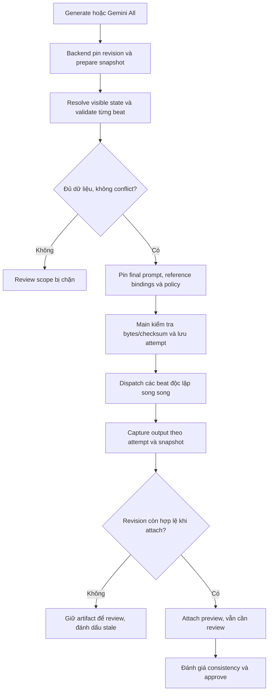

# Kế hoạch sửa tính nhất quán hình ảnh khi Gemini sinh beat song song

**Ngày:** 2026-09-06  
**Trạng thái:** PROPOSED / TARGET — chỉ là kế hoạch triển khai, chưa sửa runtime và chưa chứng minh chất lượng ảnh đã cải thiện.  
**Phạm vi chính:** Storyboard → Gemini All/Generate → backend prompt context → Electron main → Gemini Web.  
**Mục tiêu:** Các beat thuộc cùng diễn biến giữ đúng nhân vật, trang phục, địa điểm và phong cách; thay đổi hình ảnh chỉ xảy ra khi có thay đổi trạng thái hoặc chỉ đạo nghệ thuật hợp lệ.

## 1. Vấn đề và tiêu chí thành công

Ảnh người dùng cung cấp có ba scene, tổng 16 beat. Cùng nhân vật nam xuất hiện với áo xám, áo đen và áo cổ lọ/vest; căn phòng, giường và phong cách thể hiện cũng thay đổi. Các ảnh là bằng chứng về kết quả lệch, chưa đủ để kết luận lỗi race condition hay thiếu reference.

Không lấy trang phục ở một ảnh bất kỳ làm sự thật của truyện. Phải đối chiếu source, appearance đã duyệt và prompt đã gửi. Không coi số lượng 16 beat là quy tắc sản phẩm.

Kế hoạch có hai nhóm tiêu chí độc lập:

| Nhóm | Điều kiện hoàn thành |
| --- | --- |
| Đúng đầu vào | Mỗi request có snapshot bất biến, state đúng thời điểm, cast đúng beat, reference đúng phiên bản/checksum/thứ tự và style policy nhất quán |
| Đúng thực thi | Chạy song song không trộn prompt, attachment, target, output hoặc revision; lỗi sau submit không tự sinh lại |
| Chất lượng ảnh | Đánh giá ảnh thực tế theo rubric tại mục 9; kiểm thử fake không được dùng làm bằng chứng về độ giống nhân vật |
| Trải nghiệm | Người dùng biết beat đang chờ dữ liệu, cần review, stale hay đã sinh; hoàn tất generation không đồng nghĩa ảnh đã được duyệt |

Không cam kết mọi ảnh giống tuyệt đối hoặc pixel-identical. Giữ thay đổi hợp lệ về camera, biểu cảm, tư thế và diễn biến.

## 2. Nguồn tham chiếu và AS-IS

Kế hoạch này bổ sung phần Gemini Web cho [kế hoạch continuity ngày 05-09](2026-09-05-chapter-continuity-and-render-pipeline.md), không triển khai lại toàn bộ kế hoạch đó. Những mô tả AS-IS cũ trong kế hoạch ngày 05-09 phải được đối chiếu code hiện tại: repository hiện đã có continuity persistence và prompt section.

Tham chiếu:

- [ADR-0024: continuity và prompt snapshots](../decisions/ADR-0024-chapter-continuity-selective-regeneration-and-render-reuse.md).
- [ADR-0021: ranh giới Gemini Web](../decisions/ADR-0021-desktop-gemini-web-image-generation.md).
- [Image generation workflow](../workflows/IMAGE_GENERATION.md).
- [Desktop renderer structure](../codebase/DESKTOP_RENDERER_STRUCTURE.md).
- [CONTRIBUTING](../../CONTRIBUTING.md), [AGENTS](../../AGENTS.md).

Các đường dẫn code dạng inline bên dưới tính từ repository root. Tên type, endpoint và file có nhãn **đề xuất** chưa phải implementation hiện có.

| Bằng chứng trong code đã đọc | Ý nghĩa cho kế hoạch |
| --- | --- |
| `app/desktop/src/renderer/features/storyboard/queries/storyboard-media.mutations.ts`: `generateGeminiStoryboardImage` lấy `getGeminiContext` riêng cho từng beat rồi materialize references và submit | Chưa có batch snapshot ID trong contract này; cần kiểm tra việc các request có thể nhìn thấy revision khác nhau |
| `app/desktop/src/renderer/features/storyboard/model/gemini-queue.ts`: state lưu chapter/beat IDs và tiến độ | Queue hiện không pin prompt fingerprint, canon/ref revisions hoặc continuity revision |
| `app/desktop/src/main/gemini-web/gemini-web-ipc.ts`: nhận prompt và character references, resolve local files rồi gọi browser pool | Điểm cần gắn snapshot provenance và kiểm tra integrity trước submit |
| `app/desktop/src/main/gemini-web/gemini-web-automation.ts`: mở fresh conversation, chọn image mode, preset `Điện ảnh`, model rồi attach references | Các lượt không dựa vào chat memory. Cần đo ảnh hưởng của preset với style minh họa; chưa kết luận preset là nguyên nhân |
| `VisualPromptComposer.java` dưới backend `feature/generation/application/service/`: có CHARACTER LOCKS, CURRENT STATE, PINNED CONTINUITY, ENVIRONMENT, STYLE và reference map | Không sửa bằng cách chỉ thêm một câu chung “keep consistent”; cần bảo đảm dữ liệu các section đầy đủ và không mâu thuẫn |
| `VisualPromptComposer.currentState`: ưu tiên `appearancePrompt`, chỉ ghép age/hair/injury/wardrobe khi appearancePrompt trống | Có thể làm mất field cụ thể khi appearancePrompt chỉ mô tả một phần; cần test tái hiện trước khi đổi merge policy |
| `app/backend-service/src/main/resources/mybatis/VisualPromptContextMapper.xml`: appearance chọn theo project ưu tiên và `updated_at DESC`; reference giới hạn qua composer là 3 | Latest appearance không chứng minh đúng state tại beat; reference budget phải được xử lý minh bạch |
| `app/backend-service/src/main/resources/mybatis/VisualPromptContinuityMapper.xml`: chọn continuity revision mới nhất cho beat | Query này chưa trực tiếp lọc source hash hiện hành; phải kiểm tra guard phía admission/materialization trước khi kết luận stale lọt tới generation |
| `ContinuityPromptSection.java`: render entry/visible facts, bỏ UNKNOWN và thông báo continuity ưu tiên hơn generic canon | Đã có nền tảng continuity; cần kiểm tra subject binding, cast filtering và conflict resolution thực tế |
| `gemini-image-quality.ts`: kiểm tra kích thước, tỉ lệ và metadata | Chưa phải bộ đánh giá semantic về khuôn mặt, trang phục hay không gian |

ADR-0021 có mô tả main thêm style wrapper, còn workflow hiện tại ghi backend sở hữu final prompt. Đường IPC đã đọc chuyển prompt xuống automation. Task 0 phải xác nhận toàn bộ đường gọi và thống nhất tài liệu theo implementation cuối cùng; không thêm wrapper trùng lặp chỉ để khớp tài liệu cũ.

## 3. Giả thuyết và cách phân biệt nguyên nhân

| Ưu tiên | Giả thuyết chưa được xác nhận cho batch lỗi | Phép kiểm chứng |
| --- | --- | --- |
| H1 | State trang phục/địa điểm thiếu, không đúng timeline hoặc xung đột giữa canon, continuity và visualIntent | So sánh snapshot hai beat liền nhau, trace mỗi field về source/appearance revision; regression fixture phải phát hiện field thiếu/xung đột |
| H2 | Context bị thay đổi trong lúc batch chạy vì resolve live theo từng beat | Cố ý sửa canon/appearance/continuity giữa hai worker; batch phải giữ cùng snapshot hoặc báo stale, không trộn revisions |
| H3 | Reference chỉ khóa identity, chưa đủ khóa outfit/style/set; preset hoặc nội dung reference gây cạnh tranh với style | So sánh cùng snapshot với policy preset khác nhau và với/không có approved visual anchor; thay một biến mỗi lần |
| H4 | Attachment/refLabel hoặc output bị lẫn giữa các slot/browser khi chạy đồng thời | Fake adapter có marker khác nhau, upload chậm và completion đảo thứ tự; đối chiếu trace với beat ID và checksum |
| H5 | Đầu vào đúng nhưng provider vẫn tạo variation | Giữ nguyên snapshot/model/preset, chạy mẫu lặp có giới hạn; human review đo drift còn lại |

Task 0 phân loại lỗi vào input, transport hoặc provider quality. Nếu chưa có prompt/trace của batch gốc, tiếp tục xây deterministic fixture nhưng ghi rõ chưa tái hiện batch gốc. Kết quả synthetic không thay thế bằng chứng của ảnh người dùng.

## 4. Phương án được đề xuất

### 4.1 Lựa chọn

| Phương án | Lợi ích | Đánh đổi | Quyết định |
| --- | --- | --- | --- |
| Giảm concurrency về 1 | Hữu ích để đối chứng lỗi transport | Không tự sửa state thiếu; fresh chat vẫn độc lập | Chỉ dùng chẩn đoán hoặc giảm tải tạm thời |
| Tăng độ dài prompt/gửi toàn chapter cho mọi beat | Dễ thử | Tăng nhiễu, có thể đưa nhân vật ngoài scope vào ảnh; không pin revisions | Không làm mặc định |
| Pin batch inputs + resolve state + kiểm tra transport | Sửa tính nhất quán đầu vào, giữ throughput và khả năng truy vết | Cần contract/persistence/versioning | Bắt buộc cho bản sửa |
| Approved visual anchor cho nhóm continuity | Bổ sung bằng chứng thị giác cho style/outfit/set | Tốn reference budget và có bước duyệt; có thể sao chép pose/cast ngoài scope | Giai đoạn có điều kiện sau đánh giá bản sửa cơ bản |

### 4.2 Luồng đích



Nhóm bị thiếu dữ liệu chặn các beat phụ thuộc; nhóm độc lập có thể tiếp tục sau khi UI thông báo rõ scope. Không coi scene ID là ranh giới continuity tuyệt đối: một căn phòng và outfit có thể kéo dài qua nhiều scene. Ngược lại, flashback hoặc đổi trang phục trong một scene phải tạo state khác.

## 5. Thiết kế dữ liệu và ranh giới trách nhiệm

### 5.1 Tái sử dụng trước khi thêm model

Tái sử dụng `chapter_continuity_plans`, scene/beat continuity states, report revisions và prompt snapshot infrastructure đã có theo ADR-0024. Task 0 kiểm kê schema/use cases thực tế. Chỉ thêm bảng/field khi đường Gemini chưa có nơi biểu diễn đúng invariant; không tạo hệ thống continuity thứ hai.

Backend giữ business state và snapshot metadata trong PostgreSQL. Electron main giữ reference/output bytes ở project-local storage, browser execution journal và checksum validation. Renderer hiển thị state và điều phối thao tác qua API/bridge thật.

### 5.2 Contract đề xuất

| Contract | Dữ liệu cần pin | Invariant |
| --- | --- | --- |
| `GenerationBatchSnapshot` | batch ID, project/chapter ID, source hash, storyboard revision, continuity plan/report revision, compiler/style policy version, tập beat snapshot IDs | Một lần prepare pin toàn scope nhất quán; không resolve lại “latest” ở từng worker |
| `BeatGenerationSnapshot` | beat ID/row version, timeline key, continuity group, resolved visible state, participating cast IDs, canon/appearance/outfit version IDs khi có, final prompt, negative prompt, ordered references, input fingerprint | Nội dung immutable; single Generate và All dùng cùng compiler/prepare service |
| `ResolvedVisibleState` | identity theo cast, appearance hiện tại, wardrobe, injury, props/ownership, location/layout, time/light, palette, allowed action/camera delta | Mỗi fact có provenance, subject ID và state scope; không dùng exit state tương lai làm current state |
| `ReferenceBinding` | label, role, asset ID/checksum, identity/appearance/location/style binding, applicable timeline/group, approval/version metadata | Thứ tự attach khớp map; loại reference khác nhau có thẩm quyền theo thuộc tính khác nhau |
| `GenerationAttempt` | attempt ID, snapshot ID/fingerprint, browser/slot/target identity cục bộ, requested/observed model-preset, timestamps, stage, output checksum/asset ID | Có bằng chứng trước submit; output chỉ hoàn tất đúng attempt; không lưu cookies/token/profile path trong backend |

Tên status và error code bên dưới là **đề xuất**, phải map vào contract hiện hữu hoặc bổ sung có version: `MISSING_CONTINUITY`, `CONTINUITY_CONFLICT`, `STALE_GENERATION_INPUT`, `REFERENCE_INTEGRITY_FAILED`, `REFERENCE_BUDGET_EXCEEDED`.

Fingerprint dùng canonical serialization, bao gồm nội dung state, ordered reference checksums/roles, prompt, compiler/style/provider policy. Không đưa timestamp hay thứ tự worker hoàn thành vào fingerprint. Audit ID vẫn được lưu riêng; model/preset quan sát khác policy phải fail trước submit hoặc ghi rõ provider policy mismatch.

### 5.3 Resolve state và xử lý xung đột

1. Resolve đúng timeline và thời điểm beat; state change có evidence mới thay state trước đó. Flashback không thừa hưởng outfit hiện tại một cách tự động.
2. Bind stable subject keys trong continuity sang đúng Character/ProjectCharacter/canon IDs và canonical names. Lọc cast trước khi serialize prompt; không chèn nguyên chapter ledger.
3. Identity reference giữ mặt/tỉ lệ/đặc điểm lâu dài. Appearance/outfit state đã pin giữ quần áo, thương tích và tóc thay đổi theo truyện. Reference identity mặc vest không được ép beat mặc vest khi state đã chỉ định áo xám.
4. Resolve field-by-field; appearancePrompt không được làm mất wardrobe/injury riêng biệt chỉ vì có text. Khi các field mô tả mâu thuẫn, trả issue có nguồn để sửa; không nối hai chỉ dẫn đối nghịch rồi yêu cầu model tự chọn.
5. Source-grounded beat state được áp dụng cho thay đổi có evidence; generic canon chỉ bù thuộc tính chưa bị thay đổi. Conflict với locked identity phải qua validation, không tự viết lại CharacterVersion.
6. Địa điểm giữ các thuộc tính ổn định và quan hệ không gian (giường, cửa, cửa sổ, vật dụng chính). Camera-relative left/right phải phân biệt với tọa độ trong phòng để tránh khóa sai khi đổi góc máy.
7. Source không nêu màu áo/bố trí phòng: dùng approved appearance/location/art direction nếu có. Nếu chưa có, đề xuất lựa chọn một lần và cho người dùng duyệt; lưu provenance nghệ thuật riêng, không giả mạo `SOURCE`. Thuộc tính không quan trọng có thể bỏ trống với warning; field quan trọng cho scope cần chốt trước dispatch.
8. VisualIntent và shot direction là delta hành động/bố cục. Nội dung source/provider vẫn là untrusted data; không cho phép ghi đè policy bằng câu lệnh trong truyện hoặc reference.

### 5.4 References và visual anchor

Bản sửa cơ bản giữ giới hạn hiện tại 3 ảnh/request, chọn ổn định và công khai nhân vật nào chưa có reference. Không âm thầm làm rơi primary identity để nhét thêm ảnh bối cảnh. Vượt budget gây thiếu reference bắt buộc phải trả issue trước submit; text fallback chỉ cho trường hợp policy cho phép và UI thể hiện limitation.

Giai đoạn anchor chỉ mở khi phép đo chứng minh cần thiết:

- Chọn asset đã duyệt hoặc sinh anchor candidate trong một operation đã được cho phép; candidate phải review trước khi làm dependency của batch.
- Scope anchor theo timeline, location state, appearance state và style revision; đổi scene đơn thuần không tạo anchor mới. Không gán cố định một ảnh mỗi scene/chapter.
- Anchor có người chỉ được dùng cho beat có cast phù hợp. Beat chỉ có A không nhận frame có A+B; cân nhắc environment/style reference không có người hoặc appearance reference riêng, vẫn trong budget.
- Vai trò anchor được ghi rõ: set/style/outfit evidence, không sao chép hành động, crop hoặc đưa thêm nhân vật. Không dùng output chưa duyệt hoặc “ảnh vừa xong gần nhất” làm shared mutable reference.
- Nếu chọn composite reference sheet hoặc tăng giới hạn ảnh, phải có thử nghiệm riêng và thay contract toàn tuyến; không mặc định đây là giải pháp.

### 5.5 Snapshot, stale và retry

- Prepare đọc cùng database snapshot/transaction nhất quán và kiểm tra source/report/ownership trước lưu. Pin version IDs, không chỉ version number hoặc tên nhân vật.
- Nếu backend chưa có API phù hợp, **đề xuất** một command prepare batch dưới chapter generation API: nhận beat IDs + expected revision + idempotency key, trả immutable snapshot IDs và issues. Route cụ thể theo conventions hiện có sau Task 0; không dùng GET đọc context live làm snapshot ngầm.
- Trước dispatch kiểm tra revision và asset eligibility. Nếu source/canon bị thay đổi, dừng pending scope với stale reason; output đang chạy được lưu để review và không tự attach vào revision mới.
- Main materialize theo asset ID + expected checksum, dùng shared in-flight promise để tránh tải trùng; lỗi materialize xóa entry in-flight để có thể thử lại an toàn trước submit.
- Persist bytes phục vụ attempt theo cơ chế immutable đã có hoặc attempt-local copy được integrity check; không cho file đổi giữa lúc hash và lúc upload.
- Lưu attempt stage trước external submit. Sau submit mà timeout/crash không rõ kết quả: đánh dấu outcome `UNKNOWN`, reconcile từ evidence/session/output; không tự replay sang tab/account khác.
- Queue local chỉ là execution progress cache. PostgreSQL giữ durable business metadata; attempt journal cục bộ gửi reconciliation metadata về backend khi kết nối lại, không trở thành nguồn business authority thứ hai.
- Resume kiểm tra snapshot/version và các attempt chưa rõ kết quả. Completed/reviewed media được giữ; cập nhật snapshot tạo batch revision mới cho scope cần chạy lại.
- Không biến Gemini Web thành provider API có cost/reconciliation giả. Rà ADR-0021 về giới hạn hiện tại; nếu thêm admission/journal contract thì cập nhật ADR. Mọi AI call tốn phí bổ sung (anchor/audit/repair) đi qua OperationPlan, estimate/reservation, entitlement/abuse checks và attribution thực.

## 6. Các bước triển khai

Thứ tự: T0 → T1 → T2 → T3 → T4 → T5 → T7. T6 có điều kiện và cần hoàn thành trước T7 nếu được chọn. Mỗi task gồm code, test đúng seam và tài liệu liên quan; chỉ đánh dấu hoàn tất sau khi có bằng chứng. Không giao việc song song cho subagent theo mặc định.

### T0 — Tái hiện và chốt baseline

**Files đọc/kiểm kê:** các file AS-IS ở mục 2; `app/desktop/test/storyboard-gemini-resilience.test.mjs`, `storyboard-gemini-queue.test.mjs`, `gemini-browser-pool.test.mjs`, `gemini-web-automation-pool.test.mjs`; backend `VisualPromptComposerTest.java`, `VisualPromptContinuityTest.java`; worker continuity schema/pipeline/tests hiện có.

- [ ] Thu thập hai beat đổi trang phục và toàn batch nếu có: source revision, actual submitted prompt, refs/checksums, model/preset, snapshot/report, output mapping. Lưu artifact debug cục bộ có giới hạn; không commit nội dung riêng tư.
- [ ] Trace Generate/All từ renderer đến CDP; xác nhận final prompt ownership và style wrapper có thực tồn tại ở đường nào.
- [ ] Kiểm kê guards source/current report, snapshot persistence và reference approval hiện có trước khi bổ sung schema.
- [ ] Viết fixture nhỏ: cùng hai nhân vật và một phòng qua nhiều scene; outfit ổn định rồi một event đổi outfit; một flashback; một beat chỉ có một nhân vật.
- [ ] Chạy test actual context/dispatch seam để tái hiện field mất, mixed revision hoặc attachment/output mix nếu có. Ghi command và kết quả red; không dùng regex kiểm tra source làm bằng chứng duy nhất.

**Hoàn thành khi:** có bảng nguyên nhân được xác nhận/chưa xác nhận, baseline payload và ít nhất một vòng regression bắt đúng lỗi đầu vào/thực thi đã tìm thấy; nếu chỉ còn provider variation thì ghi rõ để chuyển trọng tâm sang đánh giá chất lượng.

### T1 — Resolve continuity/appearance đúng thời điểm

**Files sửa dự kiến:** backend `VisualPromptContextRepository.java`, `MyBatisVisualPromptContextPersistenceAdapter.java`, `VisualPromptContextMapper.xml`, `VisualPromptContinuityMapper.xml`, `ContinuityPromptSection.java`, `VisualPromptComposer.java`. Worker `continuity/schema.py`, `continuity/pipeline_contracts.py`, `chapter_analysis_prompts.py` chỉ sửa nếu trace chứng minh output thiếu contract cần thiết.

- [ ] Resolve cùng canon version cho character text và reference; pin appearance/outfit theo beat state thay vì mặc định latest cho mọi thời điểm.
- [ ] Áp dụng field merge và conflict rules tại mục 5.3; kiểm tra subject mapping/cast filtering và legacy beat thiếu participation metadata.
- [ ] Kiểm tra source hash, continuity plan/report revision hiện hành; không cho stale plan trở thành “pinned continuity” mới.
- [ ] Schema/migration chỉ mở rộng nếu dữ liệu hiện có không đủ; thêm Flyway migration mới, không sửa migration đã áp dụng.
- [ ] Test PostgreSQL/MyBatis với nhiều appearance/revisions, source stale, reference pin mismatch, field bị che bởi appearancePrompt, flashback, cast trống và real outfit transition.

**Hoàn thành khi:** fixture cho ra state đúng từng beat và mọi xung đột quan trọng được báo trước compiler; thay revision mới không sửa lịch sử.

### T2 — Prepare immutable batch snapshots

**Files sửa:** backend generation API/usecase/persistence theo mapping T0; `VisualBeatPromptContextAdapter.java`; `packages/client-contracts/src/generation.ts`; storyboard `api/storyboard.api.ts`. **File đề xuất:** `PrepareStoryboardGenerationBatchUseCase.java` trong feature generation/application/usecase nếu chưa có use case tương đương.

- [ ] Thêm prepare contract cho one-beat và batch scope, pin dữ liệu trong transaction nhất quán, trả issues có beat/field/source.
- [ ] Persist snapshots/fingerprints và liên kết scope với existing continuity plan; authorize ownership qua Spring Security session.
- [ ] Idempotency cùng key/cùng payload trả cùng kết quả; key khác payload bị từ chối; không dùng IDs của tenant khác.
- [ ] Kiểm tra stale khi dispatch/attach; UI refresh không được tạo snapshot revision ngầm hoặc âm thầm ghi đè approved media.
- [ ] Test concurrent update trong prepare, retry, scope sai chapter/tenant, stale attach, compiler policy đổi và single/batch prompt parity.

**Hoàn thành khi:** mọi beat trong một batch truy về cùng set nguồn đã pin; GET context live không còn là nguồn quyết định của pending jobs.

### T3 — Chuẩn hóa style và reference transport

**Files sửa:** `VisualPromptComposer.java`, `CharacterIdentityPromptComposer.java` nếu cần; Desktop `gemini-web-ipc.ts`, `gemini-web-automation.ts`, `gemini-web-model-selection.ts`, shared/preload reference contracts; tests `gemini-web-cinematic-flow.test.mjs` và test transport mới.

- [ ] Dùng một server-owned style policy cho identity references và storyboard; pin policy version vào snapshots.
- [ ] Thử nghiệm preset hiện tại so với policy minh họa nhất quán. Không xóa preset/chuyển model theo suy đoán; sau lựa chọn, code xác nhận trạng thái UI đã áp dụng trước submit.
- [ ] Truyền role/checksum/version reference xuyên backend → preload → main; label map và thứ tự bytes phải khớp tuyệt đối.
- [ ] Reference identity/outfit/environment có instruction authority riêng; budget lỗi phải rõ ràng, không silently truncate.
- [ ] Behavioral tests cho upload thiếu/chậm/sai thứ tự, duplicate labels, corrupt bytes, policy mismatch và prompt-injection payload; giữ baseline output capture sau upload.

**Hoàn thành khi:** có thể đối chiếu submitted input với snapshot; policy không xung đột giữa backend và browser wrapper/preset.

### T4 — Dispatch/attempt isolation và resume

**Files sửa:** storyboard `queries/storyboard-media.mutations.ts`, `model/gemini-queue.ts`, `store/gemini-queue.persistence.ts`, `screens/StoryboardScreen.tsx`; main `gemini-web-ipc.ts`, `gemini-browser-pool.ts`, `gemini-web-automation-pool.ts`; execution journal/local storage module theo T0.

- [ ] Queue dùng prepared beat snapshots, không re-fetch latest prompt khi một slot rảnh.
- [ ] Deduplicate materialization bằng checksum-aware in-flight promise; local integrity và upload lease giữ bytes ổn định.
- [ ] Gắn attempt ID/snapshot fingerprint cho browser/slot/target và output; lưu stage trước submit, reconcile UNKNOWN trước retry.
- [ ] Pause chặn công việc chưa submit; in-flight có thể hoàn tất nhưng phải đi qua stale guard. Resume/refresh/restart không duplicate attempt đã submit.
- [ ] Test completion đảo thứ tự, hai chapter/batch đồng thời, một ref upload lỗi, browser mất kết nối, crash sau submit, pause/resume, edit giữa batch và output late-arrival.

**Hoàn thành khi:** harness concurrent không có prompt/ref/output mix, duplicate submission hoặc attach sai revision; independent beats vẫn tận dụng concurrency cấu hình.

### T5 — Hiển thị readiness, provenance và review

**Files sửa:** `StoryboardScreen.tsx`, `GeminiQueueBanner.tsx`, `VisualBeatGrid.tsx`, `BeatRegenerationAction.tsx` và component Prompt & details thực tế sau khi trace; shared contracts/query cache.

- [ ] Generate All có bước chuẩn bị, hiển thị beat thiếu dữ liệu/conflict/stale và action sửa cụ thể; không yêu cầu checkbox xác nhận chung cho mọi story.
- [ ] Prompt & details phân biệt current draft với input thực sự đã dùng cho output; cho xem/copy submitted prompt và ordered refs, style/continuity revision khi cần debug.
- [ ] “Generated” và “Approved” tiếp tục tách biệt; cho review theo cùng continuity group, giữ ảnh cũ khi regenerate để so sánh.
- [ ] Thay đổi canon/appearance làm pending scope stale có thông báo; regenerate chọn scope qua backend hiện có thay vì client tự suy diễn dependencies.
- [ ] Test interaction/error/empty/loading và runtime flow theo mục 9.3; dùng semantic design tokens hiện có.

**Hoàn thành khi:** người dùng hiểu vì sao một scope chưa sẵn sàng và input nào đã tạo ảnh; có runtime screenshot evidence. Nếu không chạy được automation thì ghi runtime-verification blocked.

### T6 — Visual anchor có điều kiện

**Điều kiện mở:** baseline sau T1–T4 vẫn có drift thị giác đáng kể dù input/transport đúng, hoặc đánh giá trước đó chứng minh anchor cần thiết.

**Files sửa dự kiến:** generation context/reference selection, asset approval/version binding, project-local asset resolution và review components. Thêm ADR cho anchor lifecycle nếu mở rộng quyết định kiến trúc hiện hữu.

- [ ] Áp dụng scope/cast/budget rules mục 5.4; chọn approved assets trước khi tính việc sinh thêm.
- [ ] Lưu binding bất biến và chỉ dispatch dependent beats sau khi anchor ready/approved; chưa duyệt không được tự thăng cấp thành canon.
- [ ] State transition tạo binding phù hợp, không nối mọi beat thành chuỗi image-to-image.
- [ ] Test reference budget, anchor có cast ngoài scope, rejected/deleted/stale asset, thay outfit/timeline và independence giữa groups.
- [ ] Đánh giá đối chứng có/không anchor với cùng input và budget; ghi latency, số bước duyệt, chi phí và copy-pose/cast leakage.

**Hoàn thành khi:** có bằng chứng anchor giảm drift và không vi phạm cast isolation/reference budget. Nếu không đạt, giữ tính năng deferred và ghi lý do.

### T7 — Rollout và tài liệu

**Files cập nhật:** workflow IMAGE_GENERATION, DESKTOP_RENDERER_STRUCTURE, AI_WORKER_CODEBASE khi worker đổi; ADR-0021/0024 hoặc ADR mới cho quyết định vượt phạm vi; chính plan này và regression fixtures.

- [ ] Migration additive; dữ liệu chapter cũ được phân loại legacy/missing continuity và có đường prepare/review, không tự reanalyze hay regenerate tất cả.
- [ ] Batch đang dở với queue format cũ được pause và yêu cầu prepare phần pending; không xóa asset đã sinh/duyệt.
- [ ] Backend-controlled rollout policy pin vào snapshot. Tắt tạo batch mới theo policy mới khi cần rollback; batch cũ vẫn đọc được provenance và reconcile được attempts.
- [ ] Chạy narrow checks rồi full local gate, kiểm tra docs drift và Desktop runtime.
- [ ] Lưu báo cáo chất lượng thực, giới hạn còn lại và checklist acceptance; không ghi IMPLEMENTED/PASS chỉ dựa trên việc có code.

**Hoàn thành khi:** các gate mục 9 đạt hoặc limitation được ghi rõ với task còn mở; tính năng chưa được gọi DONE nếu runtime UI chưa xác minh.

## 7. Phân kỳ giao hàng

| Mốc | Deliverables | Điều kiện chuyển mốc |
| --- | --- | --- |
| M0 — Baseline | T0, evidence và regression seam | Phân biệt input/transport/provider uncertainty |
| M1 — Input consistency | T1–T2 | State/version/reference snapshot invariants đạt |
| M2 — Parallel execution | T3–T4 | Dispatch isolation, stale và UNKNOWN tests đạt |
| M3 — Creator verification | T5 và benchmark cơ bản | Runtime review flow hoạt động; quyết định T6 dựa trên dữ liệu |
| M4 — Release | T6 nếu cần, T7 | Quality report + full verification + migration/rollback readiness |

Ưu tiên sửa vấn đề đã tái hiện trước. Không cần đổi renderer architecture, thêm Redis, microservice, broker, web editor hay huấn luyện model riêng để thực hiện kế hoạch này.

## 8. Ma trận regression tối thiểu

| Tình huống | Kết quả bắt buộc |
| --- | --- |
| Cùng nhân vật/phòng, nhiều scene liên tục | Giữ state identity/outfit/location; scene boundary không tự reset |
| Đổi trang phục có evidence | Đổi từ beat đúng thời điểm, không đổi Character identity |
| Flashback cùng người | Timeline state độc lập, không lấy latest appearance của hiện tại |
| appearancePrompt có text nhưng thiếu wardrobe | Field wardrobe hợp lệ vẫn xuất hiện hoặc conflict được báo rõ |
| Một beat chỉ có A trong scene A+B | Context/reference không tự đưa B vào foreground |
| Beat không có người | Không sinh character context giả |
| Identity reference mặc outfit khác | Outfit hiện tại có authority đúng; identity vẫn giữ khuôn mặt |
| Nhiều người vượt 3 required refs | Issue budget rõ, không âm thầm mất identity |
| Edit source/canon khi batch đang chạy | Pending stale; output cũ giữ provenance và không attach sang revision mới |
| Missing/corrupt/deleted reference | Fail trước submit, không fallback ảnh khác |
| Upload chậm, output đảo thứ tự | Mỗi beat giữ đúng prompt/ref/output |
| Timeout sau submit, restart, resume | UNKNOWN/reconciliation, không blind-resubmit |
| Prompt/source chứa chỉ dẫn đổi style hoặc gọi công cụ | Giữ policy và untrusted data boundary |
| Provider từ chối nội dung | Hiển thị failure/review đúng, không thay prompt để né bộ lọc |

## 9. Kiểm chứng và acceptance gate

### 9.1 Kiểm thử deterministic

Chạy test liên quan cho từng task; kiểm thử fake chỉ xác minh contract và lifecycle. Dùng PostgreSQL integration tests cho pinning, transaction, stale và ownership; unit test đơn lẻ không chứng minh snapshot atomic.

Lệnh nền từ CONTRIBUTING, thực hiện ở đúng thư mục:

```powershell
# app/backend-service: dùng -Dtest=<các test thực sự sửa> cho vòng lặp hẹp
./mvnw.cmd test

# app/desktop
npm test
npm run type-check
npm run build

# app/ai-worker, chỉ khi worker được sửa
python -m pytest
python -m ruff check .
python -m mypy src

# repository root: gate cuối
python scripts/check-docs-drift.py
pwsh -File scripts/verify-local.ps1
```

Dùng runtime/dependency và Maven cache theo môi trường thực tế, không tự đổi cấu hình global. Ghi riêng failure có sẵn và failure do thay đổi này; giữ nguyên worktree đang có.

### 9.2 Đánh giá ảnh thật

Chuẩn bị corpus từ batch gốc nếu có quyền truy cập và một bộ synthetic có transition rõ. Baseline và bản sửa dùng cùng source/canon/shot inputs; pin/ghi model, preset và account/session policy, thời gian chạy. Thử concurrency 1 và mức cấu hình thực tế với ít nhất hai slot khi môi trường cho phép. Giá trị concurrency là biến thử nghiệm, không là product limit mới.

Chạy từng biến độc lập: current inputs → resolved inputs/snapshots → selected style policy → optional anchor. Đề xuất 3 batch lặp mỗi cấu hình nếu budget cho phép; số ít hơn phải ghi rõ limitation. Không tự thực hiện generation tốn phí hoặc mass regeneration chỉ để hoàn tất plan.

Mỗi cặp beat liên quan được human review chấm 0–2 cho từng chiều:

- Identity: đúng người, mặt/tỉ lệ/tuổi ổn định.
- Appearance: outfit, tóc, thương tích đúng state.
- Environment: layout, props và thời điểm không nhảy vô cớ.
- Style: chất liệu minh họa, rendering, palette nhất quán với policy.
- Narrative: hành động/camera thay đổi đúng; không cố đồng nhất bằng cách lặp một ảnh.

`0 = lỗi rõ`, `1 = lệch nhẹ/khó kết luận`, `2 = đạt`. Tách thay đổi hợp lệ theo truyện khỏi drift. Báo cáo count và tỷ lệ theo từng chiều, severe failures và sample size; tránh chỉ dùng một điểm trung bình che lỗi tráo identity.

**Ngưỡng release đề xuất:** không có lỗi tráo người hoặc outfit transition sai nghiêm trọng trong corpus chấp nhận; ít nhất 90% cặp đạt 2 ở từng chiều continuity; không thấp hơn baseline ở narrative fidelity. Đây là mục tiêu nghiệm thu, chưa phải số liệu đạt được. Nếu không đạt thì mở scope repair/anchor hoặc giữ feature ở trạng thái chưa đủ bằng chứng, không tự hạ ngưỡng sau khi xem kết quả.

Đo thêm wall-clock batch time, số call/attempt, số ref tải, tỷ lệ stale/missing/rejected/UNKNOWN, số ảnh phải tạo lại và số bước review. Với Gemini Web không có billing telemetry đáng tin cậy thì báo call count/thời gian và ghi cost unavailable; không suy ra tiết kiệm tiền từ fake tests.

### 9.3 Desktop runtime bắt buộc khi triển khai UI

Start/reuse Electron/Vite và automation được hỗ trợ. Dùng real backend APIs với test project; mock chỉ trong isolated tests.

Thực hiện: mở storyboard → prepare All → xử lý missing/conflict → chạy nhiều slot → pause/resume → sửa appearance/source giữa batch → kiểm tra stale → xem Prompt & details → review/approve → regenerate scope → reload/restart. Nếu bật anchor, thêm select/approve/reject anchor và budget failure.

Kiểm tra console, failed requests, loading/error/empty states, layout/overflow, ảnh/ref đúng beat và việc runtime không chọn fake data. Capture screenshots sau thay đổi, đối chiếu docs/design hiện tại. Automation không khả dụng hoặc login/provider chặn flow phải ghi **runtime-verification blocked**, không thay bằng build pass.

## 10. Các quyết định còn cần dữ liệu khi triển khai

| Câu hỏi | Mặc định của kế hoạch | Khi nào cần chốt |
| --- | --- | --- |
| Batch gốc có continuity/ref nào? | Chưa biết; không dùng ảnh output để tự suy ra canon | T0, trước kết luận root cause |
| Snapshot infrastructure hiện có đủ cho Gemini? | Mở rộng/reuse trước, không thêm bảng song song | T0/T2 |
| Thiếu thuộc tính thị giác không có trong truyện? | Chọn approved art direction một lần cho scope; provenance riêng | T1, trước dispatch scope liên quan |
| Preset Điện ảnh có làm lệch manhwa? | Giữ là giả thuyết; dùng đối chứng | T3 |
| Cần visual anchor không? | Deferred tới khi input/transport đúng và benchmark cho thấy cần | Sau M2/M3 |
| Có thay ranh giới admission/execution Gemini không? | Giữ boundary hiện tại, bổ sung provenance và reconcile thật; cập nhật ADR nếu mở rộng | T2/T4 |

## 11. Checklist hoàn tất triển khai

- [ ] Root cause đã được phân loại bằng evidence; unresolved provider variation được ghi riêng.
- [ ] Single Generate và All dùng chung immutable snapshot/compiler contract.
- [ ] Identity, appearance, location, style và state transitions đúng scope/revision.
- [ ] Reference bytes/order/roles có integrity evidence; parallel jobs không lẫn output.
- [ ] Stale, pause/resume, UNKNOWN và retry đã qua regression.
- [ ] Output luôn giữ trạng thái review phù hợp; approved history không bị ghi đè.
- [ ] Narrow tests, repository gate và Desktop runtime verification đạt.
- [ ] Quality benchmark ảnh thật đạt ngưỡng hoặc task chất lượng còn mở được ghi minh bạch.
- [ ] Docs/ADR phản ánh hành vi cuối cùng; giữ các thay đổi sẵn có của người dùng.

**Phạm vi hoàn thành của yêu cầu hiện tại:** tạo và rà soát tài liệu kế hoạch này. Tất cả checkbox triển khai ở trên còn mở; không biểu thị code đã được sửa.
