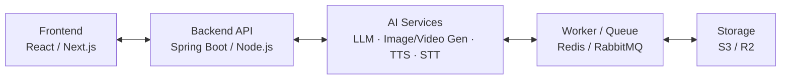

# NarrativeX — Timeline triển khai & vận hành

Asset logo chính: [`narrativex-logo.png`](../../app/frontend-web/public/branding/narrativex-logo.png)

## 1. Tổng quan các phase

| Phase | Thời gian | Trọng tâm |
|---|---:|---|
| Phase 1 — Setup & Clean | Tuần 1–2 | Chuẩn hóa nền tảng, môi trường và kết nối UI–backend |
| Phase 2 — Core Features | Tuần 3–5 | Hoàn thiện pipeline script → AI → audio/video → export |
| Phase 3 — Enhancement | Tuần 6–7 | Short video, preset, character consistency và realtime |
| Phase 4 — Test & Launch | Tuần 8–9 | Kiểm thử, beta, production và public launch |

## 2. Chi tiết theo phase

### Phase 1 — Setup & Clean · Tuần 1–2

- Setup môi trường dev/staging/prod bằng Docker.
- Refactor và clean code, chuẩn hóa cấu trúc project.
- Tích hợp UI với backend: API, authentication, upload và các luồng liên quan.
- Hoàn thiện database schema và seed data.
- Viết tài liệu API bằng Swagger/OpenAPI.

### Phase 2 — Core Features · Tuần 3–5

- Xử lý script và phân tích nhân vật, cảnh bằng AI.
- Tạo ảnh/video theo scene bằng Text-to-Image và Text-to-Video.
- Text-to-Speech và ghép audio.
- Render video và xuất nhiều tỉ lệ: `16:9`, `9:16`, `1:1`.
- Quản lý lịch sử, thư viện và dự án của user.

### Phase 3 — Enhancement · Tuần 6–7

- Tạo highlight/short tự động cho Reels, Shorts và TikTok.
- Tùy chỉnh style, giọng đọc và phụ đề.
- Template, preset và bảo đảm character consistency.
- Queue job và background worker khi cần.
- Realtime progress qua WebSocket hoặc SSE.

### Phase 4 — Test & Launch · Tuần 8–9

- Test chức năng và hiệu năng.
- Fix bug và tối ưu trải nghiệm người dùng.
- Beta test với nhóm user dùng thử.
- Triển khai production trên VPS hoặc Cloud.
- Marketing và public launch.

## 3. Timeline theo tuần

| Tuần | Nội dung |
|---:|---|
| 1 | Setup môi trường, deploy dev |
| 2 | Tích hợp UI + Backend |
| 3 | AI phân tích script và nhân vật |
| 4 | Tạo ảnh/video, TTS |
| 5 | Render và export video |
| 6 | Short/Highlight, preset |
| 7 | Realtime, tối ưu |
| 8 | Test, beta |
| 9 | Go live và Marketing |

## 4. Kiến trúc tổng quan

## 5. Kiến trúc stack chính trong ảnh

| Thành phần | Công nghệ được nêu trong ảnh |
|---|---|
| Frontend | React / Next.js |
| Backend | Spring Boot / Node.js |
| Database | PostgreSQL / MySQL |
| AI | OpenAI / Runway / Pika |
| Queue | Redis / RabbitMQ |
| Storage | S3 / Cloudflare R2 |

## 6. Triển khai & vận hành

| # | Hạng mục | Phạm vi |
|---:|---|---|
| 1 | Environment | Docker, Nginx, SSL, Domain |
| 2 | CI/CD | GitHub Actions hoặc GitLab CI |
| 3 | Monitoring | Sentry cho error; Prometheus + Grafana cho metrics |
| 4 | Storage | Cloud Storage: S3 hoặc Cloudflare R2 |
| 5 | Backup | Tự động backup database và assets |
| 6 | Scaling | Worker queue: Redis hoặc RabbitMQ |

## 7. Mục tiêu sau launch

- Website hoạt động ổn định và mượt mà.
- User có thể tạo video từ script trong khoảng 5–15 phút.
- Hỗ trợ short video cho TikTok, YouTube và Reels.
- Có hệ thống quản lý dự án, lịch sử và thư viện.
- Sẵn sàng scale và mở rộng các tính năng mới.

## 8. Lưu ý khi áp dụng vào NarrativeX hiện tại

Phần trên là nội dung được chuyển thể từ ảnh; các quy tắc dưới đây là ràng buộc triển khai của repository và có độ ưu tiên cao hơn các lựa chọn công nghệ mang tính minh họa trong ảnh:

- PostgreSQL là nguồn sự thật cho business state. Redis dùng cho queue/cache/progress/scheduling và các counter abuse-control tạm thời; không dùng Redis để thay thế dữ liệu nghiệp vụ bền vững.
- Backend giữ hình dạng modular monolith Spring Boot. Runtime AI/media và các dependency Python thuộc về AI worker; domain backend không import provider SDK.
- Auth runtime hiện tại là Spring Security + email/password/Google OIDC + HttpOnly server session + CSRF. Password login/register có Redis-backed abuse limiting. JWT/accessToken/refreshToken chưa migrate trong phase bug-fix hiện tại và phải được thiết kế/triển khai riêng.
- Các provider bên ngoài phải có reservation trước khi submit. Kết quả không rõ ràng phải ở trạng thái `UNKNOWN` và được reconcile trước khi retry.
- Tác vụ tốn chi phí phải đi qua `OperationPlan`, cost estimate/reservation, entitlement, abuse check và usage attribution.
- Story text, prompt, reference và provider output đều là dữ liệu không tin cậy: cần moderation, prompt-injection boundary, schema validation và output review; `REAL_PERSON_REFERENCE` cần consent/use-right khi áp dụng. Copyright dispute xử lý qua report/review/evidence/takedown, không bằng blanket per-story rights-attestation checkbox.
- Character identity, approved asset và render version là dữ liệu versioned/immutable; không nên coi “character consistency” là một thao tác stateless.
- Consolidated Flyway V1 excludes legacy StoryVersion rights columns and `content_rights_attestations`; không mô tả các field/table đó như active hoặc compatibility schema.
- Mốc “5–15 phút”, số lượng ảnh/video và thời lượng đầu ra là mục tiêu sản phẩm, không phải quy tắc cố định. Visual planning phải dựa trên duration, semantic complexity, reuse và delta.
- Production launch cần kiểm tra thêm backup/restore, observability, deletion/retention, real-person consent, broader abuse controls, entitlement server-side và provider resilience.

## 9. Thông điệp thương hiệu trong ảnh

> **NarrativeX — Your Story, Our AI, Infinite Possibilities.**
